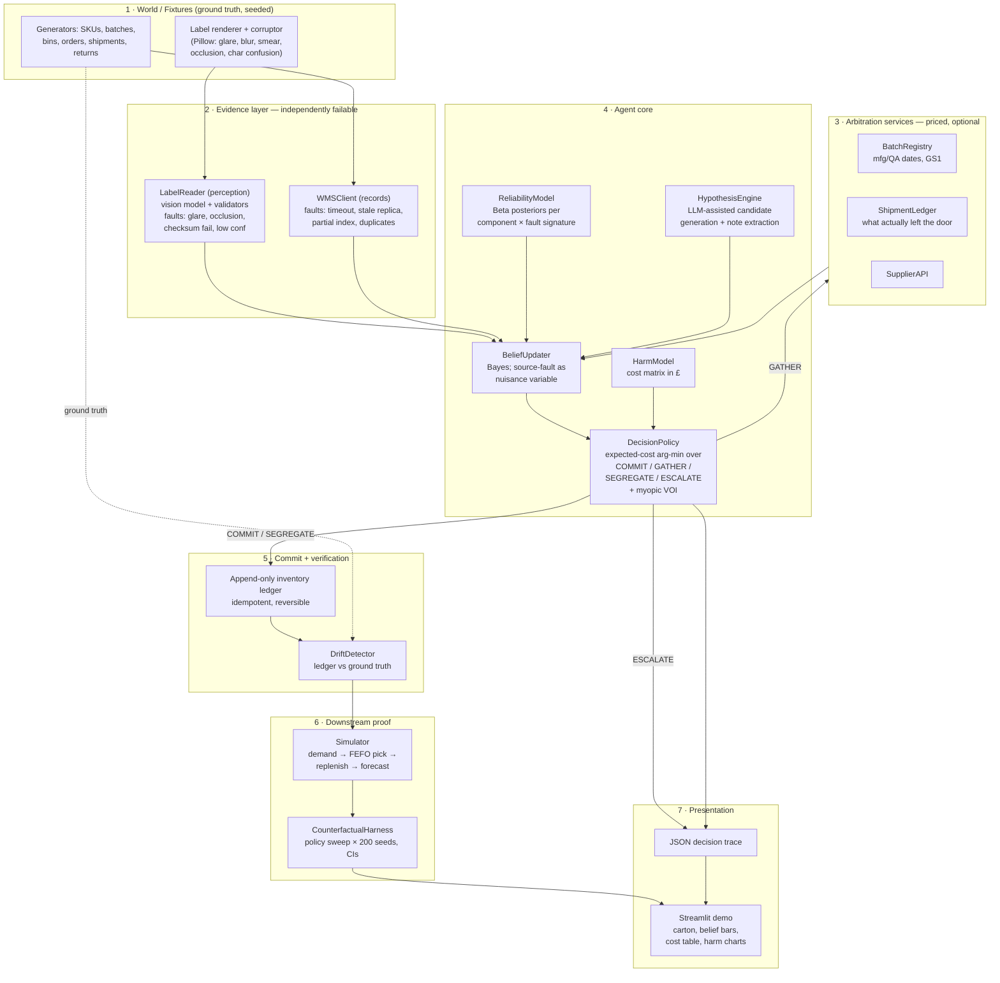

# Reconciling Inventory from Partial Returns with Conflicting Metadata — Implementation Plan

**Repo:** `LEC_AI` · **Source brief:** [`objectives.md`](./objectives.md) · **Plan date:** 2026-08-15

---

## 0. Executive summary

We are building **RECONCILE**, an agent that processes partial stock returns in a
distribution warehouse. Each returned carton carries physical metadata (batch code,
best-before date, handwritten condition notes) that may contradict the warehouse
management system (WMS). The agent must work out which source to believe, decide
whether it is worth paying for external arbitration, and then reassign the stock to a
physical bin — all without corrupting the inventory record.

The core of the design is that **the agent does not follow a decision tree**. It
maintains a probability distribution over candidate batch assignments, and at each
step picks whichever action minimises *expected downstream harm* measured in pounds:
commit to a bin now, buy more evidence, segregate under a conservative expiry, or
escalate to a human. Those four are genuinely competing — each one wins outright in at
least one of our scenarios, and which one wins is determined at runtime by the belief
state and a harm cost matrix, not by hardcoded thresholds.

The harm claim is not rhetorical. A downstream simulator (demand → FEFO picking →
replenishment → forecasting, run over a 180-day horizon and 200 seeds) converts each
assignment decision into concrete outcomes: units shipped past their real best-before
date, write-off value, stock-out days, forecast error, and **silent-drift days** — how
long the bad write sits undetected. We ship this as a *test that fails* if the harm
delta collapses to zero.

**Headline result the demo is built around:** in the hero scenario the crisp, high-confidence,
checksum-valid label is *wrong*, and trusting it puts 84 units of infant formula into
the picking queue with an expiry four months later than reality. The simulator shows
those units shipping roughly ten weeks past their true best-before, ~118 days after the
mistake was made, with nobody noticing in between.

---

## 1. Close reading of the brief

### 1.1 What is explicitly demanded

| # | Requirement (paraphrased) | Source line |
|---|---|---|
| **R1** | At least two *sequential* decisions about a single return: (a) trust embedded metadata vs system records, (b) which bin to reassign to, conditioned on (a). | Req. ¶1 |
| **R2** | Genuinely competing strategies chosen **at runtime**, not a fixed sequence. | Req. ¶1 |
| **R3** | Two **independently failing** components that interact: a physical-metadata reader/validator, and a warehouse-record query. | Req. ¶2 |
| **R4** | When both fail or conflict, the agent reasons about **which failure is more likely** and acts on that — **with no fallback to a default choice**. | Req. ¶2 |
| **R5** | Two independent failure modes handled: (a) metadata unreadable/corrupted, (b) metadata internally consistent but conflicting with *multiple plausible* warehouse records. | Task ¶, sentence 4 |
| **R6** | Three available responses to the conflict: trust physical evidence, query external sources to arbitrate, or flag for manual review. | Task ¶, sentence 2 |
| **R7** | Correct bin reassignment **without introducing data drift**. | Task ¶, sentence 3 |
| **R8** | Prove the decision affects downstream correctness, with **measurable** harm (stock-out predictions, expired shipments). Harm must be **real, not hypothetical**. | Req. ¶3 |
| **R9** | Working implementation, not a mock-up. | Task ¶, final sentence |
| **R10** | Three-minute video showing a return **where the obvious choice is wrong**. | Task ¶, final sentence |

### 1.2 Ambiguities, and how we resolve them

These are the places where the brief could be read two ways. Each resolution is a
design commitment, and each has a corresponding proof artefact (see §9).

**"No fallback to a default choice" (R4).** The narrow reading — never call
`escalate_to_human()` — contradicts R6, which explicitly offers manual review as one of
three legitimate responses. We adopt the stronger, more interesting reading: *there is
no unconditional `else` branch anywhere in the decision path.* Every terminal action,
including escalation, must be the arg-min of an explicit expected-cost computation over
the current posterior, and must be logged with the losing alternatives and their costs.
Escalation is a **chosen** action when irreducible ambiguity makes it cheapest, never an
exception handler. We prove this by mutating the cost matrix in a test and asserting the
chosen action changes (§9, PO-4).

**"Genuinely competing strategies" (R2).** We read this as requiring that no single
fixed policy can match the agent across the scenario suite. So the counterfactual
harness includes fixed-policy baselines (`always-trust-label`, `always-trust-wms`,
`always-escalate`, `always-segregate`) and we report an **aggregate across a scenario
mix** in which each baseline is beaten by the agent, and each baseline wins on at least
one individual scenario. If a fixed policy tied with the agent in aggregate, the
scenario suite would be too easy and we would have failed R2 on the merits.

**"Which failure is more likely" (R4).** This needs a mechanism, not a vibe. We give
each evidence component a **calibrated reliability model**: Beta posteriors over failure
rates, conditioned on observable *fault signatures* (OCR: glare, occlusion, checksum
failure, low character confidence; WMS: replica lag, watermark inversion, duplicate
records, timeout). The agent compares posterior failure probabilities of the two
components given their signatures. This is the machinery that makes the phrase
operational.

**"Without introducing data drift" (R7).** Defined concretely as divergence between the
recorded inventory state and physical ground truth, measured on four axes:
batch-attribution error rate, expiry L1 error in **unit-days**, bin misplacement count,
and *compounded* drift after subsequent pick/return cycles. Compounding is what makes
the failure silent, so we measure and plot it over the horizon.

**"Prove harm is real" (R8).** A single anecdote is not proof. Proof =
(1) a full downstream simulator with ground truth, (2) a policy sweep over ≥200 seeds,
(3) a reported confidence interval on the harm delta that excludes zero, and
(4) a `pytest` assertion that fails if it does not. The test is the proof artefact.

### 1.3 What the brief does *not* constrain (our freedom)

- Industry vertical — we choose chilled/ambient FMCG (infant formula), because
  best-before dates carry genuine consumer-safety weight and FEFO picking is standard.
- Whether perception is real or simulated ("simulated or real") — we render real label
  images and run a real vision model over them, which costs little and makes the demo
  far more convincing than a stubbed string.
- Agent framework — unconstrained, so we optimise for auditability (§5.2).

---

## 2. Goals and non-goals

### 2.1 Primary goals

- **G1 — Decide well under uncertainty.** Beat every fixed policy on aggregate expected
  harm across the scenario suite.
- **G2 — Be auditable.** Every decision emits a structured trace: hypotheses,
  likelihoods, posterior, candidate actions, each action's expected cost, the winner,
  and the margin. A reviewer can reconstruct any decision without rerunning the agent.
- **G3 — Prove the harm.** Ship a reproducible counterfactual harness with CIs and a
  failing-if-untrue test.
- **G4 — Be filmable.** A single-screen demo that shows belief updating and cost
  comparison live, in one take, deterministically.

### 2.2 Secondary goals

- **G5 — Never silently corrupt the ledger.** Append-only, idempotent, reversible writes.
- **G6 — Calibration over confidence.** The agent's stated 0.86 should be right ~86% of
  the time; we measure this with a reliability diagram and Brier score across seeds.
- **G7 — Cost-awareness.** Arbitration API calls and human reviews are priced and
  budgeted; the agent must not buy evidence it does not need.

### 2.3 Explicit non-goals

- Not a production WMS integration (SAP EWM / Manhattan connectors are out of scope).
- Not a general-purpose OCR research contribution — we use an off-the-shelf vision model.
- Not multi-warehouse or multi-echelon network optimisation.
- Not a UI product; the demo surface exists to serve the video and the reviewer.
- Not real-time/streaming — returns are processed as discrete cases.

---

## 3. Domain model and the hero scenario

### 3.1 Entities

- **SKU** — `SKU-4471`, *NutriPlus Infant Formula 800g*, unit cost £11.40.
- **Batch** — id, manufacture date, QA-release date, best-before date, home bin, quantity on hand.
- **Bin** — id, zone, capacity, temperature class, status (`active` / `quarantine` / `hold`).
- **Order / Shipment** — customer, lines, allocated batch, dispatch timestamp.
- **Return** — customer, SKU, quantity, arrival timestamp, carton images, condition notes.
- **Inventory ledger** — append-only, signed movements; the system of record we must not drift.

### 3.2 Batch fixtures for the hero case (today = 2026-08-15)

| Batch | Manufactured | QA released | Best before | Home bin | On hand |
|---|---|---|---|---|---|
| `B-2288` | 2025-09-12 | 2025-09-19 | **2026-09-30** (46 days out) | `A-07-02` | 1,120 |
| `B-2290` | 2025-11-03 | 2025-11-10 | 2026-11-30 | `A-07-05` | 780 |
| `B-2291` | 2026-01-20 | **2026-06-28** | **2027-03-15** | `C-04-01` | 2,400 |

### 3.3 The hero scenario — "S4: the obvious choice is wrong"

Customer `CUST-118` (a regional distributor) ordered 240 units and is returning **84** —
a genuine partial return. What the agent sees:

1. **Physical evidence.** The carton label is clean and well-lit. Vision read:
   `B-2291`, best before `2027-03-15`. Character confidence 0.94, GS1-style check digit
   **valid**, date format **valid**, internally **fully consistent**. Every surface
   signal says trust it. This is the obvious choice.
2. **System records.** The WMS has *two* plausible outbound shipments to `CUST-118` for
   this SKU: `SH-77120` (2026-06-02, drew from `B-2288`) and `SH-77455` (2026-07-19,
   drew from `B-2290`). **Neither is `B-2291`.** This is failure mode (b) from R5:
   the metadata is internally consistent but conflicts with multiple plausible records.
3. **The tell, available only if the agent pays for it.** The batch registry shows
   `B-2291` was released from QA hold on **2026-06-28** — *after* `SH-77120` shipped —
   and has never been allocated to `CUST-118`. A **temporal impossibility**. The label is
   genuine but belongs to a reused outer sleeve from the customer's own repack line.
4. **The corroborator.** The free-text condition note reads
   *"outer sleeve re-taped, inner cases show print date 12SEP25"* — which matches
   `B-2288`'s manufacture date of 2025-09-12. This is unstructured text that the LLM
   layer extracts and the belief layer scores.

**Resulting posterior:** `B-2288` 0.86 · `B-2290` 0.11 · other 0.03.

**Why it hurts if you trust the label.** 84 units get recorded with a best-before of
2027-03-15 when the truth is 2026-09-30 — a **166-day** expiry overstatement, and they
are filed in the wrong zone (`C-04-01` instead of `A-07-02`). FEFO picking will not
touch them for months. Two harms follow:

- **Safety/compliance:** the units are picked around simulator day ~120 and ship roughly
  **ten weeks past their real best-before date**. At £48/unit recall-and-replace
  exposure, that is **~£4,032** on a single return.
- **Availability:** `B-2288`'s true on-hand is understated by 84 units, so the
  near-expiry rotation trigger never fires, while 84 phantom long-dated units inflate
  late-horizon availability — producing a **stock-out in week 14** that the forecast did
  not see coming.
- **Silence:** the write happens on day 0; the first externally visible symptom is on
  day ~118. **118 silent-drift days.** This is the number the video ends on.

### 3.4 Full scenario suite

| ID | Name | OCR state | WMS state | Correct action | What it proves |
|---|---|---|---|---|---|
| **S1** | Clean | valid, high conf | single unambiguous match | `COMMIT` home bin | Agent doesn't over-escalate or waste money on arbitration |
| **S2** | Corrupted label | glare, checksum fails | single unambiguous match | `COMMIT` on WMS | Failure mode (a); acts decisively without physical evidence |
| **S3** | Fog of war | unreadable | 3 open orders, 3 batches | `ESCALATE` | Escalation as a *chosen* least-cost action, not a fallback |
| **S4** | **Hero — obvious choice is wrong** | valid, high conf | 2 plausible, neither matches | `GATHER` → `COMMIT` `B-2288` | Failure mode (b); R10 |
| **S5** | Both degraded | 0.55 conf, partial read | stale replica, watermark inversion | down-weight WMS, `GATHER` ledger | R4 — reasoning about *which* component failed |
| **S6** | Near-miss twins | one-char corruption, **checksum valid for two batches** | both batches plausible | `GATHER`, then `SEGREGATE` | Residual uncertainty handled by conservative expiry, not a coin flip |

S1–S6 also form the aggregate mix used for the fixed-policy comparison (§8.3).

---

## 4. Architecture

### 4.1 Layer diagram



### 4.2 The two sequential decisions (R1)

**Decision 1 — evidential stance.** Given `LabelEvidence` and `RecordEvidence`, form a
posterior over candidate batch identities. The *action* chosen here is one of:

- `TRUST_PHYSICAL` — commit on the label's claim,
- `TRUST_RECORDS` — commit on the WMS claim,
- `GATHER(tool)` — pay for arbitration (registry / ledger / supplier),
- `ESCALATE` — hand to a human.

`GATHER` loops back into the belief update, so Decision 1 may iterate (bounded by a
budget, §4.5). This is where the "trust physical / arbitrate / manual review" triad from
R6 lives.

**Decision 2 — bin assignment**, conditioned on the posterior that Decision 1 produced:

- `COMMIT_HOME(batch)` — merge into the batch's home bin, asserting full confidence.
  Optimal when the posterior is concentrated. Cheap, but wrong-assignment cost is high.
- `SEGREGATE(conservative_expiry)` — place in a hold bin, record expiry as
  `min(plausible expiries weighted by posterior)`. Safe on the compliance axis, but
  wastes shelf life and blocks the bin. Optimal in the mid-confidence band.
- `QUARANTINE` — physically isolate pending human inspection.
- `ESCALATE` — do not write to the ledger at all.

The mid-confidence band where `SEGREGATE` wins is **not hardcoded**. It emerges from the
harm cost matrix: as expired-shipment cost rises relative to shelf-life waste, the band
widens. PO-4 (§9) tests exactly this.

### 4.3 Belief update

Hypotheses `H = (batch, expiry, quantity_split)`. Evidence `E = {label, records, arbitration…}`.

```
P(H | E) ∝ P(H) · Π_s P(E_s | H, F_s) · P(F_s | signature_s)
```

where `F_s` is the latent fault state of source `s`. Treating source failure as an
explicit nuisance variable — rather than as a hard filter — is what lets the agent say
*"the label is legible but the source that produced it is likely compromised"*, which is
precisely the hero case. Marginalising over `F_s` gives the "which failure is more
likely" reasoning demanded by R4, in closed form and fully loggable.

Likelihood for OCR corruption uses an explicit **character confusion matrix**
(`1↔l↔I`, `0↔O↔D`, `5↔S`, `8↔B`, `2↔Z`) so that edit distance between the read string and
a candidate batch code is weighted by *optical* plausibility, not raw Levenshtein. S6
depends on this.

### 4.4 Decision policy

For each candidate action `a`:

```
EC(a) = Σ_H P(H | E) · Harm(a, H) + Cost(a)
```

`Harm(a, H)` comes from the cost matrix (§4.6). `Cost(a)` is the direct cost — API fee
and latency for `GATHER`, analyst time for `ESCALATE`, bin-occupancy and shelf-life
waste for `SEGREGATE`, zero for `COMMIT`.

For `GATHER`, we compute a **myopic expected value of sample information**: simulate the
tool's possible returns under the current posterior, compute the post-update best action
for each, and take the expectation. `GATHER` is chosen only when the expected harm
reduction exceeds the tool's price. This is what stops the agent buying evidence in S1.

The policy returns `argmin_a EC(a)` with an explicit tie-break on direct cost, and
**asserts** at runtime that the action set was non-empty and the arg-min was computed —
there is no `else: return COMMIT`. Every decision logs the full `EC` table.

### 4.5 Budgets and termination

- Max 3 `GATHER` calls per return; max £2.50 arbitration spend per return.
- Loop terminates when the policy selects a terminal action, or budget is exhausted —
  at which point the policy re-runs over the terminal actions only (still an arg-min,
  still not a default).
- Hard wall-clock cap of 45s per return for the live demo.

### 4.6 Harm cost matrix (initial values, tunable via config)

| Outcome | Unit cost | Note |
|---|---|---|
| Unit shipped past true best-before | £48.00 / unit | recall, replacement, admin, goodwill |
| Premature write-off (usable stock binned) | £11.40 / unit | unit cost |
| Stock-out | £6.00 / unit-day | lost margin + expedite |
| Shelf-life waste from conservative expiry | £0.04 / unit-day | opportunity cost |
| Human review | £14.00 / return | 20 min analyst time |
| Arbitration API call | £0.10–£0.40 | per service |
| Bin misplacement (pick-path inefficiency) | £2.20 / event | |

These are declared in `config/harm.yaml`, and the fact that decisions *move* when this
file changes is a proof obligation, not a nice-to-have.

---

## 5. Stack

### 5.1 Chosen stack

| Concern | Choice | Why |
|---|---|---|
| Language / runtime | **Python 3.12**, `uv` for env + lockfile | Fast, reproducible installs; reviewer can run `uv sync && uv run demo` |
| Data models | **Pydantic v2** | Runtime validation at every service boundary; evidence objects are contracts, not dicts |
| Persistence | **SQLite** (`sqlite3` + light repository layer) | Self-contained, zero setup, real SQL for WMS/registry/ledger; ships in the repo |
| Perception | **Claude vision** (`claude-sonnet-5`) over Pillow-rendered carton images | Real perception on real (synthetic) images satisfies "simulated or real" honestly, and films well |
| Structured reasoning | **Claude** (`claude-sonnet-5`, `claude-opus-5` for hypothesis generation) via Anthropic SDK, tool-calling loop | Handles unstructured condition notes and corruption plausibility |
| Decision core | Hand-written NumPy/pure-Python Bayes + expected-cost policy | Deterministic, unit-testable, auditable — see §5.2 |
| Simulation | **NumPy + pandas** | Demand generation, FEFO picking, exponential-smoothing forecast |
| Stats | **SciPy** (bootstrap CIs) | Harm-delta confidence intervals |
| Label rendering | **Pillow** | Renders labels then applies parameterised corruption |
| Demo UI | **Streamlit** | One screen, one take, fast to build; charts + images + live state in ~200 LOC |
| Trace viewer | Structured JSON + **Rich** console renderer | Terminal traces film well and are diffable in CI |
| Testing | **pytest**, **Hypothesis** (property tests on ledger invariants) | Ledger conservation laws are exactly what property testing is for |
| Determinism | Seeded RNG everywhere; LLM temp 0 + **recorded response cassettes** | The demo must not flake on camera or in CI |
| Lint/format | **ruff**, **mypy --strict** on `agent/` | |
| CI | GitHub Actions: lint, types, tests, counterfactual harness (reduced seeds) | The harm assertion runs on every push |

### 5.2 The central design choice: hybrid LLM + deterministic decision core

**Decision.** The LLM does *perception and interpretation*. The deterministic core makes
*decisions*.

Specifically, the LLM is responsible for: reading the carton image, extracting structured
claims from free-text condition notes, proposing candidate hypotheses a rigid enumerator
would miss, and judging whether a garbled string is a plausible optical corruption of a
given batch code. The deterministic core is responsible for: the belief update, the VOI
calculation, the expected-cost comparison, and the final action selection.

**Why.** Three reasons, in order of weight:

1. **Auditability.** R2 and R4 demand we *demonstrate* that competing strategies were
   weighed and that no default was taken. A logged `EC` table with four rows and a
   margin is a demonstration. "The model decided" is not.
2. **Testability.** We can unit-test the policy across the full belief simplex and assert
   properties (monotonicity of `SEGREGATE` band in expired-shipment cost, no action
   dominance). You cannot do that to a prompt.
3. **Determinism for R10.** The video must reproduce. A sampled decision path is a
   liability on camera.

**Trade-off accepted.** A fully LLM-driven ReAct agent would be faster to build and
arguably more "agentic" in the fashionable sense. We lose some of that headline. We
mitigate by keeping genuine agency where it belongs — **the agent still chooses which
tools to call, when to stop gathering, and whether to escalate**, and those choices vary
across scenarios in the trace. Agency is in the control flow, which we can prove, rather
than in the token stream, which we cannot.

**Rejected alternatives:**

- *Pure LLM ReAct loop.* Rejected: non-reproducible decisions, no defensible proof of R4.
- *Pure rules engine.* Rejected: cannot handle free-text notes or optical corruption
  plausibility; would also make R2 ("not a fixed sequence") indefensible.
- *LangGraph / CrewAI orchestration.* Rejected: framework overhead buys us little for a
  single-agent loop with four actions, and obscures the decision logic we most need to
  put on screen.
- *Postgres + Docker Compose.* Rejected: setup friction for a reviewer; SQLite is
  sufficient and the repo stays `git clone && uv run`.
- *Real OCR (Tesseract).* Kept as an optional second reader behind an interface — useful
  as a disagreeing perception source, but not on the critical path.

### 5.3 Other notable design choices

- **Append-only ledger with reversible transactions.** Every write is a signed movement
  with a `causation_id` pointing at the decision trace that produced it. Nothing is ever
  updated in place, so drift is always attributable and always undoable. This is how we
  satisfy R7 in a way that survives inspection.
- **Fault injection as configuration, not code.** Each evidence component takes a
  `FaultProfile`; scenarios are YAML. Adding a seventh scenario requires no code change,
  which matters when we are tuning the demo the night before filming.
- **Cost matrix in a config file, not constants.** Makes PO-4 (decisions move when costs
  move) a one-line test rather than a refactor.
- **Ground truth is held by the world layer and is unreachable from the agent.** Enforced
  by module boundary + a test that greps the agent package for ground-truth imports. Without
  this, every harm number is suspect.

---

## 6. Repository layout

```
LEC_AI/
├── objectives.md
├── PLAN.md                       ← this file
├── README.md                     ← quickstart, results table, video link
├── pyproject.toml / uv.lock
├── config/
│   ├── harm.yaml                 harm cost matrix
│   ├── reliability.yaml          component failure priors
│   └── scenarios/                S1…S6 YAML definitions
├── world/                        ground truth — NOT importable by agent/
│   ├── generators.py             seeded SKUs, batches, bins, orders, returns
│   ├── labels.py                 Pillow render + corruption pipeline
│   └── truth.py                  oracle interface for scoring only
├── services/                     independently failable evidence sources
│   ├── label_reader.py           vision + validators + FaultProfile
│   ├── wms_client.py             SQL + FaultProfile (stale replica, dupes, timeout)
│   ├── batch_registry.py         arbitration: mfg/QA dates, GS1
│   ├── shipment_ledger.py        arbitration: dispatch record
│   └── faults.py                 fault signatures + injection
├── agent/
│   ├── evidence.py               Pydantic evidence contracts
│   ├── reliability.py            Beta posteriors per component × signature
│   ├── hypotheses.py             candidate generation (LLM-assisted)
│   ├── confusion.py              optical character confusion matrix
│   ├── belief.py                 Bayesian update w/ fault marginalisation
│   ├── harm.py                   cost matrix loader + Harm(a, H)
│   ├── voi.py                    myopic expected value of sample information
│   ├── policy.py                 expected-cost arg-min over the action set
│   ├── loop.py                   the two-decision control loop + budgets
│   └── trace.py                  structured decision trace emitter
├── ledger/
│   ├── ledger.py                 append-only, idempotent, reversible
│   └── drift.py                  drift metrics vs ground truth
├── downstream/
│   ├── demand.py                 seeded negative-binomial demand
│   ├── picking.py                FEFO picker
│   ├── replenish.py              reorder-point policy
│   ├── forecast.py               exponential smoothing / Croston
│   ├── simulate.py               180-day horizon runner
│   └── metrics.py                expired-shipped, stock-out days, MAPE, silent-drift days
├── harness/
│   ├── policies.py               agent + 4 fixed baselines + oracle
│   └── counterfactual.py         policy × seed sweep, bootstrap CIs
├── demo/
│   ├── app.py                    Streamlit single-screen demo
│   ├── trace_view.py             Rich terminal renderer
│   └── shotlist.md               video script with timings
├── tests/
│   ├── test_policy.py            no-default, arg-min, cost sensitivity
│   ├── test_belief.py            calibration, fault marginalisation
│   ├── test_ledger.py            Hypothesis property tests (conservation)
│   ├── test_scenarios.py         S1–S6 expected actions
│   ├── test_harm_is_real.py      ← the R8 proof; fails if delta ≈ 0
│   └── cassettes/                recorded LLM responses
└── artifacts/
    ├── traces/                   committed JSON traces for S1–S6
    └── results/                  committed counterfactual table + charts
```

---

## 7. Implementation phases

Estimates assume one engineer. Total ≈ 5–6 focused days.

| Phase | Deliverable | Est. | Exit criterion |
|---|---|---|---|
| **P0 — Skeleton** | repo scaffold, `uv`, ruff/mypy/pytest, CI green on an empty suite | 0.3d | `uv run pytest` passes |
| **P1 — World** | generators, SQLite schema seeded with batches/bins/orders/shipments; label renderer + corruption pipeline; S1–S6 YAML | 0.8d | Can render a corrupted `B-2291` carton and dump the DB |
| **P2 — Evidence services** | `LabelReader` (vision + checksum/format/date validators), `WMSClient`, fault injection with signatures | 1.0d | Each service fails on demand, in isolation, with a labelled signature |
| **P3 — Belief core** | evidence contracts, confusion matrix, reliability model, Bayesian update with fault marginalisation | 1.0d | Posterior on S4 is `B-2288`-dominant *only after* arbitration; unit tests on synthetic likelihoods |
| **P4 — Policy** | harm matrix, `Harm(a,H)`, VOI, arg-min policy, two-decision loop, budgets, trace emitter | 1.0d | S1–S6 produce the expected actions in §3.4; trace JSON committed |
| **P5 — Ledger + drift** | append-only ledger, idempotency, reversal, drift metrics | 0.5d | Hypothesis property tests pass on unit conservation |
| **P6 — Downstream proof** | demand, FEFO picker, replenishment, forecast, metrics, counterfactual harness, bootstrap CIs | 1.0d | `test_harm_is_real` passes with CI excluding zero; results table committed |
| **P7 — Demo surface** | Streamlit app, Rich trace view, cassette-backed determinism | 0.7d | Full S4 run, cold start, no network, under 45s |
| **P8 — Video** | shot list, 3 takes, edit to ≤3:00 | 0.5d | §10 |
| **P9 — Polish** | README with results table, arbitration budget tuning, calibration diagram | 0.4d | Reviewer can reproduce headline number from a clean clone |

**Critical path:** P1 → P2 → P3 → P4 → P6 → P8. P5 and P7 can slip a day without
endangering the video. If time is short, cut S6 and the Croston forecast first; never cut
P6, which is the entire basis of R8.

---

## 8. Measurement and evaluation

### 8.1 Decision-quality metrics

- Batch-attribution accuracy vs oracle (per scenario, and aggregate).
- Escalation rate — must be near-zero on S1/S2 (over-escalation is a failure).
- Arbitration spend per return — must be £0 on S1.
- Calibration: Brier score + reliability diagram over 200 seeds (G6).
- Decision margin: `EC(second-best) − EC(best)`; near-zero margins flag brittle cases.

### 8.2 Drift metrics (R7)

- Batch-attribution error rate.
- Expiry L1 error in **unit-days** (the 84 × 166 = 13,944 unit-day figure for S4).
- Bin misplacement count.
- **Compounded drift over the horizon** — plotted, because the compounding curve is the
  visual argument for "fails silently".

### 8.3 Harm metrics (R8) — the headline table

Run every policy on every scenario, 200 seeds, 180-day horizon. Report mean with
bootstrap 95% CI.

| Policy | Expired units shipped | Stock-out days | Write-off £ | Human cost £ | API £ | **Total harm £** |
|---|---|---|---|---|---|---|
| Oracle (upper bound) | — | — | — | — | — | — |
| **RECONCILE (ours)** | — | — | — | — | — | — |
| `always-trust-label` | — | — | — | — | — | — |
| `always-trust-wms` | — | — | — | — | — | — |
| `always-escalate` | — | — | — | — | — | — |
| `always-segregate` | — | — | — | — | — | — |

Two things this table must show to satisfy R2 and R8:

1. **RECONCILE beats every fixed policy in aggregate** — otherwise the adaptivity is
   unjustified.
2. **Each fixed policy wins on at least one individual scenario** — otherwise the
   scenarios do not present genuinely competing strategies. (`always-trust-wms` wins S4
   by luck but loses S5; `always-escalate` is harm-free but burns £14 on every trivially
   clean S1.)

Plus the **silent-drift days** figure per policy — the delay between the erroneous write
and the first externally observable symptom.

### 8.4 The proof-of-harm test

`tests/test_harm_is_real.py` asserts:

- `harm(always-trust-label, S4) − harm(RECONCILE, S4)` has a bootstrap 95% CI whose lower
  bound is **> £1,500**;
- expired-units-shipped under `always-trust-label` on S4 is **> 0** and under RECONCILE is
  **0** on ≥95% of seeds;
- aggregate harm of RECONCILE is strictly below every fixed baseline.

If the harm were hypothetical, this test would fail. That is the point.

---

## 9. Proof obligations — requirement → artefact

This table is what a reviewer should be handed alongside the code.

| ID | Requirement | Proof artefact |
|---|---|---|
| **PO-1** | R1 — two sequential decisions | `artifacts/traces/S4.json` shows Decision 1 (`GATHER`→`TRUST_RECORDS`) then Decision 2 (`COMMIT_HOME(B-2288, A-07-02)`), with distinct `EC` tables and Decision 2's posterior inherited from Decision 1 |
| **PO-2** | R2 — competing strategies at runtime | §8.3 table: each fixed policy wins ≥1 scenario, none wins aggregate. Plus 6 traces with 4 distinct action sequences |
| **PO-3** | R3 — two independently failing components | `test_scenarios.py::test_isolated_failures` — each service fails alone (S2 = OCR only, S5b = WMS only) and the agent still resolves |
| **PO-4** | R4 — no default fallback | `test_policy.py::test_no_default_branch`: mutating `harm.yaml` flips the chosen action on the *same* belief state. Plus a static check that `policy.py` contains no unconditional terminal return |
| **PO-5** | R4 — reasons about which failure is likelier | S5 trace shows WMS posterior-failure 0.71 vs OCR 0.24 given signatures, and the down-weighting flowing into the likelihood |
| **PO-6** | R5a — unreadable metadata | S2 + S3 traces; corrupted carton images in `artifacts/` |
| **PO-7** | R5b — consistent metadata, multiple plausible records | S4 trace; the label is checksum-valid and internally consistent throughout |
| **PO-8** | R6 — all three responses exercised | S1 (trust physical), S4 (arbitrate), S3 (manual review) |
| **PO-9** | R7 — no data drift | `test_ledger.py` Hypothesis property tests + drift metrics = 0 for RECONCILE on S1/S2/S4 |
| **PO-10** | R8 — harm is real and measured | `test_harm_is_real.py` + §8.3 table with CIs + compounding-drift chart |
| **PO-11** | R9 — working implementation | `uv sync && uv run demo --scenario S4` from a clean clone, offline (cassettes) |
| **PO-12** | R10 — obvious choice is wrong | The video; S4 by construction (§3.3) |

---

## 10. Demo and video plan (R10)

### 10.1 Demo surface

One Streamlit screen, four panes, no scrolling and no tab-switching on camera:

- **Top-left:** the carton photo, zoomable, with the OCR read and its confidence overlaid.
- **Top-right:** live belief bars over candidate batches, animating on each evidence update.
- **Bottom-left:** the expected-cost table for the current decision — every candidate
  action, its expected harm, its direct cost, its total, and the winner highlighted with
  the margin. *This pane is the single most important thing in the video*, because it is
  the visual proof of R2 and R4.
- **Bottom-right:** the downstream harm comparison — agent vs `always-trust-label`,
  with expired-units and stock-out-days bars and the drift-compounding curve.

Determinism: seeded RNG, LLM cassettes, no network at demo time.

### 10.2 Shot list — 3:00

| Time | Shot | Beat |
|---|---|---|
| 0:00–0:18 | Warehouse framing, the return arrives | 84 of 240 units back from `CUST-118`. Partial returns are where inventory truth goes to die. |
| 0:18–0:38 | Carton pane; the label is crisp | `B-2291`, BB 2027-03-15, confidence 0.94, **check digit valid**. "Every surface signal says trust this." |
| 0:38–1:05 | WMS pane; conflict | Two plausible shipments to this customer, neither is `B-2291`. Belief bars go flat — genuine ambiguity. |
| 1:05–1:32 | **Cost table** | Four actions priced side by side. `COMMIT` is cheap but risks £4k. `ESCALATE` costs £14 now. `GATHER` costs £0.30 and buys expected £2.9k of harm reduction. Agent buys evidence. **This is the money shot.** |
| 1:32–1:52 | Arbitration returns | `B-2291` QA-released 2026-06-28 — *after* the shipment left. Temporal impossibility. Belief collapses onto `B-2288` (0.86). |
| 1:52–2:12 | Decision 2 | Bin assignment under residual uncertainty: `COMMIT_HOME(A-07-02)` vs `SEGREGATE`. Cost table again; commit wins by a stated margin. |
| 2:12–2:48 | **The counterfactual** | Rerun with `always-trust-label`. Simulator: 84 units ship ~10 weeks past best-before, £4,032 exposure, stock-out in week 14 — and **118 days of silence** before anyone could have noticed. Drift curve compounds. |
| 2:48–3:00 | Close | Two failure modes, four competing actions, no default branch, one seed away from reproducing. |

### 10.3 Filming risks

- LLM latency on camera → cassettes, pre-warmed.
- Streamlit rerun flicker → pre-compute all states, step through with a "next" control.
- The cost table is dense → hold the shot for a full 8 seconds and highlight one row at a time.

---

## 11. Risks and mitigations

| Risk | Impact | Mitigation |
|---|---|---|
| Harm delta is real but statistically weak | R8 unproven; the whole submission wobbles | 200+ seeds, 180-day horizon, bootstrap CIs; tune horizon so the FEFO pick of misfiled stock falls inside it — verify in P6, not P8 |
| Agent over-escalates and looks trivial | Fails R2/R4 in spirit | S1/S2 assert near-zero escalation; escalation is priced at £14 so it loses when evidence is decisive |
| Scenarios feel contrived to the reviewer | Credibility | Every failure mode is a documented real warehouse failure — reused outer sleeves, replica lag during reconciliation windows, `1`/`l` glyph confusion. Cite these in the README. |
| Vision model reads the corrupted label too well | S2/S5/S6 lose their teeth | Corruption pipeline is parameterised; calibrate corruption strength against measured read accuracy in P2 and lock the parameters |
| Hybrid architecture reads as "not really an agent" | Perception of R2 | README leads with the four-action control flow and six divergent traces; agency is demonstrated as *choice*, not as prose |
| LLM non-determinism breaks the video or CI | Fails R9/R10 | temp 0 + committed cassettes; CI runs offline |
| Scope creep into a warehouse product | Miss the deadline | Non-goals in §2.3 are binding; P5/P7 are the designated slip budget |
| Ground truth leaks into the agent | Every harm number invalidated | Module boundary + import-check test (§5.3) |

---

## 12. Definition of done

- [ ] `git clone && uv sync && uv run demo --scenario S4` works offline on a clean machine.
- [ ] All six scenarios produce their expected actions (§3.4), traces committed to `artifacts/traces/`.
- [ ] `uv run pytest` green, including `test_harm_is_real.py`.
- [ ] Counterfactual results table (§8.3) committed with CIs, RECONCILE beating every fixed policy in aggregate and each fixed policy winning ≥1 scenario.
- [ ] All twelve proof obligations in §9 have a named, committed artefact.
- [ ] README opens with the headline harm number and the reproduction command.
- [ ] Video ≤ 3:00, showing S4, with the cost table and the counterfactual on screen.

---

## 13. Open questions to resolve during P1–P2

1. **Horizon length.** 180 days is a first guess. It must be long enough that misfiled
   stock actually gets FEFO-picked inside the window, or the headline harm is zero by
   construction. Verify empirically in P6 and adjust before tuning anything else.
2. **Reliability priors.** Should the Beta posteriors be warm-started from a synthetic
   history of ~500 resolved returns, or start uninformative? Warm-starting makes S5's
   reasoning sharper and more legible on camera; uninformative is more honest about a
   cold-start deployment. Leaning warm-start with the history committed and inspectable.
3. **Second perception source.** Adding Tesseract as a *disagreeing* reader alongside the
   vision model would strengthen R3 (two readers that fail differently). Worth ~2 hours
   if P2 finishes early; otherwise cut.
4. **Quantity splitting.** Should a hypothesis be allowed to split the 84 units across two
   batches (e.g. 60 from `B-2288`, 24 from `B-2290`)? Physically realistic and it makes the
   posterior richer, but it enlarges the hypothesis space considerably. Recommend
   deferring to a stretch goal after P6 is green.
