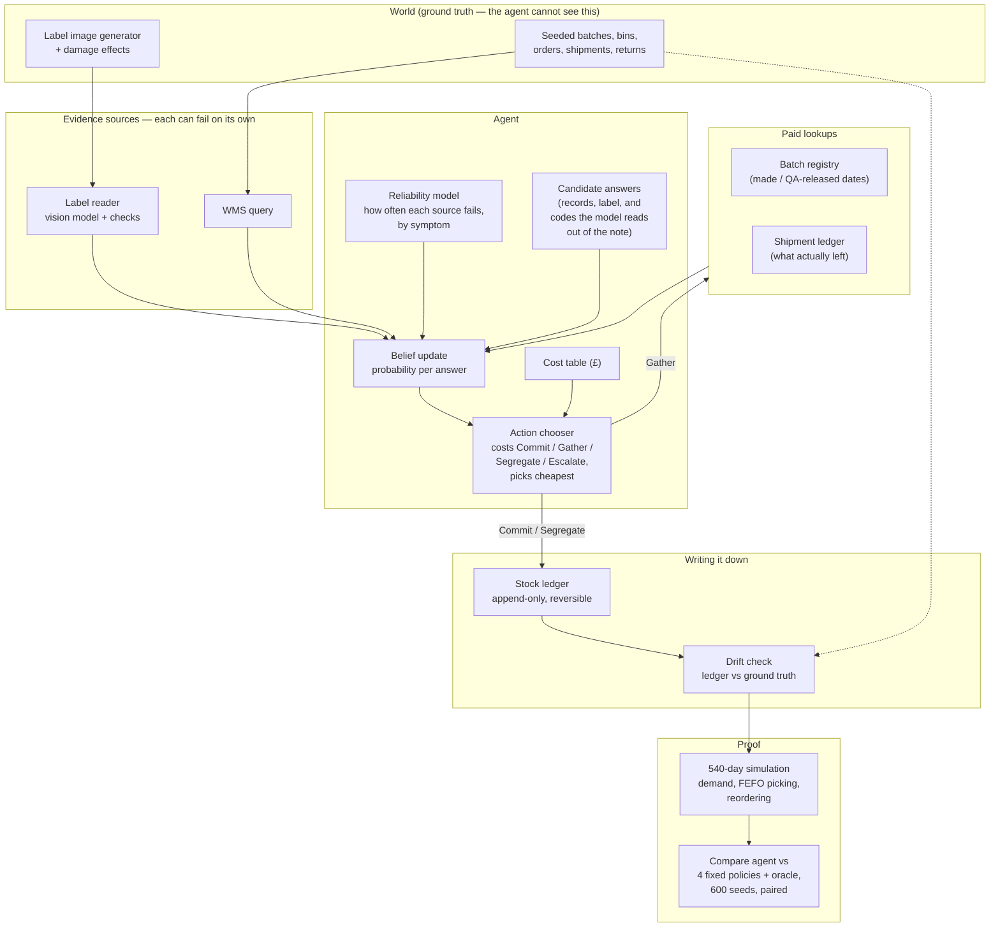

# Plan: an agent that sorts out returned stock when the labels disagree with the computer

**Repo:** `LEC_AI` · **Brief:** [`objectives.md`](./objectives.md) · **Date:** 2026-08-15

---

## 1. What we are building

A warehouse gets back part of an order — say 84 units out of 240. The boxes have labels
on them: a batch code, a best-before date, some handwritten notes. The warehouse computer
also has a record of what it thinks it sent that customer. Sometimes these two disagree.

Our agent, **RECONCILE**, decides who to believe and then decides which shelf to put the
stock on. If it guesses the batch wrong, nothing breaks immediately. Months later, someone
ships expired baby formula, or the system runs out of stock without warning. That delay is
the whole problem: the mistake is invisible when you make it.

The agent works by keeping a **probability for each possible answer** and picking whichever
action costs the least in expected pounds. It has four actions available:

1. **Commit** — write the stock to a shelf now.
2. **Gather** — pay a small fee to look up an external record and get more information.
3. **Segregate** — put the stock in a holding area using the safest (earliest) expiry date.
4. **Escalate** — send it to a human.

Nothing is hardcoded. Which action wins depends on the numbers at the time.

---

## 2. Acronyms and terms

| Term | Meaning |
|---|---|
| **WMS** | Warehouse Management System. The computer that tracks what stock is where. The "system of record". |
| **SKU** | Stock Keeping Unit. A product code, e.g. `SKU-4471` for a particular tin of formula. |
| **Batch** | One production run of a product. All units in a batch share a manufacture date and a best-before date. |
| **Bin** | A physical shelf location, e.g. `A-07-02`. |
| **FEFO** | First Expired, First Out. Standard warehouse picking rule: always ship the stock that expires soonest. This is why a wrong expiry date is dangerous — it changes what gets picked. |
| **OCR** | Optical Character Recognition. Reading text out of a photo. |
| **GS1** | The organisation behind barcode standards. GS1 batch codes have a **check digit** — a final digit calculated from the others, so a single typo makes the code fail validation. |
| **QA release** | Quality Assurance release. The date a batch was cleared for sale. A batch cannot be shipped before this date — useful for spotting impossible claims. |
| **LLM** | Large Language Model. Here: Claude, used for reading photos and free-text notes. |
| **Candidate (hypothesis)** | One possible answer we might land on, e.g. "these tins are batch `B-2288`". Every candidate carries a probability, and they add up to 1. |
| **Prior** | The probability of a candidate *before* looking at any evidence. Ours come from shipment volumes, not guesswork. |
| **Likelihood** | How well a candidate explains a piece of evidence. Not a probability of the candidate — a score for the evidence, assuming the candidate were true. |
| **Bayes / posterior** | The rule for updating probabilities as evidence arrives: multiply each candidate's prior by its likelihood, then rescale so the total is 1. The result is the "posterior". |
| **Beta distribution** | A standard way of estimating a rate (like "how often does this fail?") from a running tally of successes and failures. It also tells you how uncertain that estimate is. |
| **Calibration** | Whether stated confidence matches reality — if the agent says 87% a hundred times, it should be right about 87 times. |
| **Brier score** | A single number scoring calibration: the average squared gap between stated probability and what actually happened. Lower is better; 0 is perfect. |
| **VOI** | Value Of Information. How much a piece of information is worth before you buy it. Used to decide whether paying for a lookup is worthwhile. |
| **Data drift** | The gap between what the computer thinks is on the shelf and what is actually there. |
| **Confidence interval** | A statistical range, e.g. "the saving is £2,800 ± £400". Used to show a result is not a fluke. |
| **CI (build)** | Continuous Integration. Automated tests that run on every code push. |
| **API** | Application Programming Interface. Here: an external service the agent can call for a fee. |
| **Seed** | A number that makes random simulations repeatable. Same seed, same result. |

---

## 3. What the brief asks for

| # | Requirement |
|---|---|
| **R1** | Two decisions in sequence about one return: first *who to believe*, then *which bin*. The second depends on the first. |
| **R2** | The agent picks between real alternatives at runtime. Not a fixed script. |
| **R3** | Two components that can fail independently: one reads the physical label, one queries the WMS. |
| **R4** | When both fail or disagree, work out **which one is more likely to be broken** — with no default fallback. |
| **R5** | Handle two failure types: (a) the label is unreadable, (b) the label is perfectly readable but contradicts several plausible WMS records. |
| **R6** | Three possible responses: trust the label, pay to check an external source, or send to a human. |
| **R7** | Assign the stock to a bin without causing data drift. |
| **R8** | Prove the decision matters, with real measured harm. Not hypothetical. |
| **R9** | Working code, not a mock-up. |
| **R10** | A 3-minute video showing a return where the obvious answer is wrong. |

### Three tricky bits, and how we read them

**"No fallback to a default choice."** Read narrowly this would mean "never escalate to a
human" — but R6 explicitly lists human review as a valid response, so that reading is
wrong. We take it to mean: **there is no `else` branch in the code.** Every final action,
including escalation, must be the cheapest option out of an explicit costed list, and the
losing options must be logged with their costs. Escalation is a *choice*, not an error
handler.

**"Genuinely competing strategies."** We test this by building four dumb fixed policies
(always trust the label, always trust the WMS, always escalate, always segregate) and
running them against the agent. Two things must be true: the agent beats all four overall,
**and** each fixed policy beats the agent on at least one individual case. If no fixed
policy ever won, our test cases would be too easy and the agent's flexibility would be
pointless.

**"Which failure is more likely."** This needs a real mechanism. Each component gets a
**reliability model**: a running estimate of how often it fails, broken down by
*symptom*. The label reader has symptoms like glare, blocked view, or a failed check
digit. The WMS has symptoms like a slow replica, duplicate rows, or timestamps that are
out of order. The agent compares failure probabilities given the symptoms it can see.

---

## 4. Goals

1. **Decide well.** Beat every fixed policy on total cost across all test cases.
2. **Show your work.** Every decision logs the options, their costs, the winner, and by
   how much. A reviewer can check a decision without rerunning anything.
3. **Prove the harm.** A simulation with real numbers and a test that fails if the harm
   turns out to be zero.
4. **Be filmable.** One screen, one take, no internet needed, same result every time.
5. **Never corrupt the ledger.** Stock records are append-only and reversible.
6. **Be calibrated.** When the agent says 87% sure, it should be right about 87% of the
   time. Measured in §6.6, because if the probabilities are inflated then every cost
   calculation built on them is wrong too.

### Not doing

- No real WMS integration (SAP, Manhattan, etc.).
- No OCR research — we use an off-the-shelf vision model.
- No multi-warehouse network planning.
- Not a polished product. The interface exists to serve the video.

---

## 5. The demo case: where the obvious answer is wrong

Product: `SKU-4471`, infant formula, £11.40 a tin. Today is 2026-08-15.

| Batch | Made | QA released | Best before | Home bin |
|---|---|---|---|---|
| `B-2288` | 2025-09-12 | 2025-09-19 | **2026-09-30** (46 days away) | `A-07-02` |
| `B-2290` | 2025-11-03 | 2025-11-10 | 2026-11-30 | `A-07-05` |
| `B-2291` | 2026-01-20 | **2026-06-28** | **2027-03-15** | `C-04-01` |

Customer `CUST-118` returns 84 tins out of an order of 240.

**What the agent sees first.** The label is clean and well-lit. It reads `B-2291`, best
before 2027-03-15. Character confidence 0.94. Check digit valid. Date format valid.
Everything about it says *trust me*. **This is the obvious choice, and it is wrong.**

**The conflict.** The WMS shows two shipments to this customer for this product:
one in June from batch `B-2288`, one in July from batch `B-2290`. Neither is `B-2291`.
The label is internally perfect but contradicts two plausible records — exactly failure
type (b) from R5.

**The tell.** If the agent pays £0.30 to check the batch registry, it learns that
`B-2291` was QA-released on 2026-06-28 — *after* the June shipment left the building. It
is physically impossible for that batch to be in that shipment. The label is genuine, but
it is stuck to a reused outer box from the customer's own repacking line. (A real and
common warehouse problem.)

**The confirmation.** The handwritten note says *"outer sleeve re-taped, inner cases show
print date 12SEP25"*. That matches `B-2288`'s manufacture date. The LLM pulls this out of
the free text.

**Final belief:** `B-2288` 87%, `B-2290` 11%, anything else 2%. The full arithmetic behind
these numbers is worked through step by step in §6.5.

**Why the obvious answer hurts.** Trusting the label records 84 tins as good until March
2027 when they actually expire in September 2026 — a **166-day overstatement** — and files
them in the wrong zone. Because FEFO picks the earliest expiry first, these tins sit
untouched for months. Then:

- They get picked around day 120 and ship **roughly ten weeks past their real best-before**.
  At £48 per unit for recall, replacement and admin, that is **£4,032** from one return.
- Meanwhile `B-2288`'s real stock count is 84 tins short, so the rotation warning never
  fires, and 84 phantom long-dated tins make future availability look better than it is.
  Result: a **stock-out in week 14** that the forecast never saw.
- The mistake happens on day 0. The first visible symptom is on day 118. **118 days of
  silence.** This is the number the video ends on.

### The six test cases

| ID | Situation | Label | WMS | Right answer | Why it's in the suite |
|---|---|---|---|---|---|
| **S1** | Clean | fine | one clear match | Commit | Agent shouldn't escalate or spend money when it's obvious |
| **S2** | Unreadable label | glare, check digit fails | one clear match | Commit on WMS | Failure type (a) |
| **S3** | Nothing to go on | unreadable | 3 open orders, 3 batches | Escalate | Escalation chosen because it's genuinely cheapest |
| **S4** | **The demo case** | perfect but wrong | 2 plausible, neither matches | Gather, then commit to `B-2288` | Failure type (b), and R10 |
| **S5** | Both broken | 55% confidence, partial | stale replica, timestamps out of order | Distrust the WMS, gather | R4 — working out which one failed |
| **S6** | Near-miss twins | torn label: last digit **and check digit missing**, so `B-229?` fits two real batches | both plausible | Gather, then segregate | Leftover uncertainty handled safely rather than by coin flip |

> **Revised during the build.** S6 was originally written as "one character misread, but
> the check digit is still valid for two different batches". That turns out to be
> impossible: with the check digit scheme in `common/coding.py`, changing any single body
> digit always breaks the check digit — verified exhaustively in
> `tests/test_coding.py::test_single_digit_change_always_breaks_the_check_digit`. That is
> precisely what check digits are for. So the ambiguity now comes from the check digit
> being *physically destroyed* along with the last body digit, leaving two real batches
> that both fit and nothing left to separate them. Same test, honest mechanism.

---

## 6. How it works



### The two decisions (R1)

**Decision 1 — who do we believe?** Combine the label and the WMS record into a
probability for each candidate batch. Then pick: trust the label, trust the WMS, pay for
a lookup, or escalate. If it pays for a lookup, the new evidence feeds back in and the
decision runs again — capped at 3 lookups or £2.50 per return.

**Decision 2 — which bin?** This uses the probabilities that Decision 1 produced:

- **Commit to home bin** — merge into the batch's normal shelf. Cheap, but expensive if wrong.
- **Segregate** — holding area, recorded with the *earliest* plausible expiry. Safe, but
  wastes shelf life and ties up a bin.
- **Quarantine** — physically isolate for inspection.
- **Escalate** — write nothing.

There's a middle band of confidence where segregating beats committing. That band is
**not a hardcoded threshold** — it falls out of the cost table. Make expired shipments
more expensive and the band widens automatically. We test exactly this.

### Working out the probabilities

Standard Bayes, with one addition: **whether each source is broken is itself part of the
calculation**, rather than a yes/no filter applied beforehand. That is what lets the agent
say *"the label is perfectly legible, but the process that produced it is probably
compromised"* — which is the demo case in one sentence.

For garbled text, we don't use plain edit distance. We use a **character confusion table**
(`1↔l↔I`, `0↔O↔D`, `5↔S`, `8↔B`, `2↔Z`) so that "how likely is this misread" reflects what
actually looks similar. Case S6 depends on this.

---

#### 6.1 The two terms from the diagram

**"Candidate answers"** — the list of possible truths we are choosing between. In this
problem, one candidate is a claim of the form *"these 84 tins are actually batch X, which
expires on date Y"*. We give every candidate a probability, and those probabilities must
add up to 1. Formally these are called *hypotheses*; we call them candidates because that
is what they are — a shortlist of answers.

The list must be **complete**, or the probabilities are meaningless. So we build it in
four passes:

| Source of candidates | Example in S4 |
|---|---|
| Every batch the WMS says was shipped to this customer for this product | `B-2288`, `B-2290` |
| Whatever the label claims, even if the WMS has never heard of it | `B-2291` |
| Batches physically stored near the picked bin (mis-picks come from neighbours) | any batch in aisle A-07 |
| A catch-all **"none of the above"** | `other` |

The catch-all matters. Without it, the agent is forced to distribute 100% of its belief
across candidates it happens to have thought of, and it becomes overconfident about a
wrong answer. With it, evidence that fits *nothing* on the list pushes probability into
`other`, and a high `other` is a direct signal to escalate.

**Where the LLM helps.** The first, third and fourth passes are plain database queries —
no model needed. The LLM is used for the awkward cases:

- *Reading free text.* The note *"outer sleeve re-taped, inner cases show print date
  12SEP25"* contains a date that constrains the answer. Extracting that is language work.
- *Proposing candidates a query would miss.* If a note mentions a different customer's
  name, or a pallet ID from another region, the LLM can propose "this is cross-docked
  stock from site B" as a candidate. A `SELECT` would never generate it.
- *Judging optical plausibility.* Asking "could a smudged `B-2288` read as `B-2291`?" is a
  perception question. The confusion table handles the common cases; the LLM handles the
  odd ones (a torn label, a sticker over a sticker).

The LLM only *adds candidates to the list*. It never assigns a probability. That split is
deliberate — a forgotten candidate is a silent catastrophe, so we want a generous
generator, but a model guessing "I'd say 70%" is not something we can test or defend.

**"Reliability model"** — a running record of how often each evidence source lies to us,
broken down by the warning signs visible at the time.

A single overall failure rate is useless here. "The label reader is 94% accurate" tells you
nothing about *this* label. What we need is: *given that this image is clean, the check
digit passed, and the customer is a known repacker, how often is the label still wrong?*
So we keep separate counters per **symptom bucket**.

For each source and each bucket we store two counts: how many times it turned out right,
and how many times it turned out wrong. The estimated failure rate is:

```
failure rate  =  (times wrong + 1) / (times wrong + times right + 2)
```

The `+1` and `+2` are there so that a bucket with no history returns 50% rather than 0% or
a divide-by-zero, and so a bucket with 3 observations doesn't claim certainty. (This is a
Beta distribution used as a running estimate; the spread of that distribution also gives us
an "how sure are we about this failure rate" number, which feeds the VOI calculation.)
Counts are updated whenever a return is later resolved to ground truth — from a human
review, a stock count, or a customer complaint.

Example buckets for the label reader:

| Symptom bucket | Right | Wrong | Failure rate |
|---|---|---|---|
| Clean image, check digit valid, standard customer | 612 | 9 | 1.6% |
| Clean image, check digit valid, **repacking customer** | 88 | 17 | 16.8% |
| Glare detected, check digit failed | 14 | 61 | 80.5% |
| Partial occlusion, confidence < 0.6 | 31 | 44 | 58.4% |

And for the WMS:

| Symptom bucket | Right | Wrong | Failure rate |
|---|---|---|---|
| Fresh read, single matching record | 1,204 | 6 | 0.6% |
| Fresh read, several matching records | 340 | 51 | 13.0% |
| **Replica lag > 2h, or timestamps out of order** | 22 | 47 | 68.6% |

That last WMS row is what drives case S5. When both sources look shaky, the agent compares
their failure rates *given their current symptoms* — 68.6% versus 58.4% — and leans on the
label rather than the record. That comparison is the concrete answer to R4's "reason about
which failure is more likely".

Two things to notice. First, all of these numbers are **learned counts, not constants** —
they live in `config/reliability.yaml`, are seeded from a synthetic history, and update as
returns resolve. Second, the two label-reader rows at the top differ only by *who the
customer is*, and that single fact moves the failure rate from 1.6% to 16.8%. That is the
entire reason the demo case is solvable.

#### 6.2 How the sources' failure modes enter the maths

Each source has more than one way of being wrong, and they need separating because they
have different symptoms.

The physical evidence channel can be in one of three states:

- **OK** — the label says what is really in the box.
- **Misread** — the box is labelled correctly, but our reader got the characters wrong.
  Symptoms: glare, blur, low confidence, failed check digit.
- **Wrong label** — we read the characters perfectly, but the label does not describe the
  contents. Causes: a reused outer box, a sticker over a sticker, a repack line.

The third state is the whole trick of the demo, because **it has no symptoms**. A reused
box has a crisp, valid, high-confidence label. Every quality check we can run passes. The
only thing that raises suspicion is the customer's history — which is why the reliability
model is bucketed by customer.

The WMS has its own states: **OK**, **stale** (reading an out-of-date copy), **ambiguous**
(several records match), and **unavailable** (timed out).

We do not decide which state a source is in and then filter. We keep all states alive and
weight them, so the final likelihood of a piece of evidence is:

```
P(evidence | candidate) = Σ over states  P(state | symptoms) × P(evidence | candidate, state)
```

Reading that in English: *"add up, over every way this source could be behaving, how likely
that behaviour is given what we can see, times how likely this exact reading would be if
that were the case."*

**If a source is unavailable**, it contributes no term at all and the probabilities are
left untouched. Missing evidence is not evidence. This matters for the "no default" rule:
a timeout must not quietly nudge the agent toward any particular answer.

#### 6.3 Bayes, in one line

```
new probability  ∝  old probability  ×  how well this candidate explains the evidence
```

Multiply each candidate's current probability by its likelihood, then divide everything by
the total so it adds back to 1. That is the whole mechanism. Three properties are worth
stating because they explain the agent's behaviour:

- **Evidence multiplies, it doesn't overwrite.** A candidate starting at 3% that explains
  the evidence 15× better than its rivals ends up around 32%, not 95%. A single strong
  piece of evidence rarely settles anything on its own, which is exactly why the agent
  buys a second one.
- **Order doesn't matter.** Applying the label then the registry gives the same answer as
  the reverse. So the agent can gather evidence in whatever order is cheapest.
- **Nothing can be resurrected from zero.** If we ever set a candidate to exactly 0, no
  future evidence can revive it. This is why we never hard-eliminate — the registry lookup
  in S4 takes `B-2291` down to 0.1%, not to 0.

#### 6.4 Where the starting probabilities come from

Before any evidence, we need a prior. We take it from shipment volume, not from thin air.
For S4 the customer received 240 units of `B-2288` in June and 120 units of `B-2290` in
July. So `B-2288` is twice as likely a source as `B-2290`, purely on volume.

We then reserve a slice of probability for "this return did not come from a shipment we
have recorded" — mis-picks, cross-docked stock, returns of returns. Historically that is
about 8% of returns.

| Candidate | Reasoning | Prior |
|---|---|---|
| `B-2288` | 92% × (240 / 360) | **0.613** |
| `B-2290` | 92% × (120 / 360) | **0.307** |
| `B-2291` | in the building, never shipped here; mis-pick possible | **0.030** |
| `other` | genuinely unrecorded | **0.050** |

#### 6.5 Worked example: the full S4 calculation

This is the arithmetic behind the demo, in three steps.

**Step 1 — the label reads `B-2291`, crisp, check digit valid.**

The likelihoods come from the reliability model above. The customer is a repacker, so the
label reader's states weight as: OK 82%, misread 2%, wrong-label 16%.

- If the tins really are `B-2288`: a working reader would have said `B-2288`, so the only
  routes to a `B-2291` reading are a misread (needs two optically dissimilar character
  changes — near impossible) or a wrong label. `B-2291` is a high-volume batch, so it
  accounts for roughly a third of the wrong-label mass. **Likelihood ≈ 0.056.**
- If the tins really are `B-2290`: same reasoning. **≈ 0.056.**
- If the tins really are `B-2291`: a working reader just reads it. **≈ 0.83.**
- If `other`: **≈ 0.05.**

| Candidate | Prior | × Likelihood | = Weight | → **Probability** |
|---|---|---|---|---|
| `B-2288` | 0.613 | 0.056 | 0.0343 | **43.5%** |
| `B-2290` | 0.307 | 0.056 | 0.0172 | **21.8%** |
| `B-2291` | 0.030 | 0.830 | 0.0249 | **31.6%** |
| `other` | 0.050 | 0.050 | 0.0025 | **3.2%** |

**This is the most important number in the plan.** The label multiplied `B-2291` by more
than ten — from 3% to 32% — and *still did not put it in the lead*. The evidence that
looks decisive to a human is not decisive once you account for how often this particular
customer's labels lie. No candidate is dominant, committing to any of them risks £4,000,
and so the VOI calculation says buy the £0.30 lookup. On screen this is the moment the
bars go flat.

**Step 2 — the batch registry returns two facts.** `B-2291` was QA-released on 2026-06-28,
*after* the June shipment left; and `B-2291` has never been allocated to this customer in
any shipment.

For `B-2291` to still be the answer, both registry facts would have to be wrong, or the
tins reached the customer through a mis-pick that also escaped the allocation records.
**Likelihood ≈ 0.02.** For every other candidate the registry says nothing surprising, so
their likelihoods sit near 1 (0.95, discounted slightly because the registry itself can err).

| Candidate | Prior | × Likelihood | = Weight | → **Probability** |
|---|---|---|---|---|
| `B-2288` | 0.435 | 0.95 | 0.4134 | **63.1%** |
| `B-2290` | 0.218 | 0.95 | 0.2067 | **31.6%** |
| `B-2291` | 0.316 | 0.02 | 0.0063 | **1.0%** |
| `other` | 0.032 | 0.90 | 0.0285 | **4.4%** |

`B-2291` is finished. But the agent still isn't safe: 63% versus 32% is not enough to
commit when being wrong costs £4,032.

**Step 3 — the condition note.** The LLM extracts an inner-case print date of 12 Sep 2025.
`B-2288` was manufactured on 2025-09-12; `B-2290` on 2025-11-03.

Handwritten notes are unreliable, so this evidence is suggestive rather than conclusive —
55% if the note is right about `B-2288`, 14% chance a mistaken note would happen to name
another batch's exact date.

| Candidate | Prior | × Likelihood | = Weight | → **Probability** |
|---|---|---|---|---|
| `B-2288` | 0.631 | 0.55 | 0.3472 | **86.7%** |
| `B-2290` | 0.316 | 0.14 | 0.0442 | **11.0%** |
| `B-2291` | 0.010 | 0.05 | 0.0005 | **0.1%** |
| `other` | 0.044 | 0.20 | 0.0087 | **2.2%** |

Final answer: **`B-2288` 87%, `B-2290` 11%, anything else 2%.** The obvious answer ends up
at one part in a thousand.

Every one of these tables is what the agent writes to its decision log, so a reviewer can
check the multiplication by hand.

#### 6.6 Are the probabilities any good?

A number is only useful if it means something. We check this with a **calibration test**:
run all six cases across 200 seeds, bucket every prediction by its stated confidence, and
compare against how often it was actually right.

| Agent said | Should be right about | Acceptable range |
|---|---|---|
| 50–60% | 55% of the time | 45–65% |
| 80–90% | 85% of the time | 78–92% |
| >95% | 97% of the time | >93% |

We report this as a chart plus a single **Brier score** (average squared error between
stated probability and actual outcome — lower is better, 0 is perfect). If the agent is
systematically overconfident, the whole cost calculation is wrong, because it multiplies
harms by probabilities that are too extreme. This test is what stops that going unnoticed.

---

### Choosing an action

For each action:

```
expected cost = Σ (probability of each answer × harm if we take this action and that answer is true)
              + direct cost of the action
```

Direct cost means: the API fee for a lookup, 20 minutes of analyst time for escalation,
wasted shelf life for segregation, nothing for committing.

For **Gather**, we first work out the VOI: simulate what the lookup might return, work out
what we'd do in each case, and see how much harm that avoids on average. We only pay if
the saving beats the fee. This is what stops the agent buying information in case S1.

The chooser returns the cheapest action, breaks ties on direct cost, and **asserts** that
it actually computed a comparison. There is no `return COMMIT` at the bottom.

### Cost table (in `config/harm.yaml`, all tunable)

| Outcome | Cost |
|---|---|
| Unit shipped past its real best-before | £48.00 each |
| Good stock thrown away unnecessarily | £11.40 each |
| Stock-out | £6.00 per unit per day |
| Shelf life wasted by conservative expiry | £0.04 per unit per day |
| Human review | £14.00 per return |
| Paid lookup | £0.10–£0.40 |
| Stock filed in the wrong zone | £2.20 |

These live in a config file, not in the code, because "changing these numbers changes the
agent's decisions" is something we need to demonstrate.

---

## 7. Stack

| Part | Choice | Why |
|---|---|---|
| Language | Python 3.12, `uv` for dependencies | Reviewer runs `uv sync && uv run demo`, done |
| Data validation | Pydantic v2 | Every piece of evidence is a checked contract, not a loose dictionary |
| Database | SQLite | No setup, ships inside the repo, real SQL for the WMS and ledger |
| Reading labels | Claude vision (`claude-sonnet-5`) on generated label images | Real reading of real images — the brief allows simulated, but this is more convincing and films better. Readings are recorded to a file so the demo and tests run offline |
| Text understanding | Claude (`claude-sonnet-5`) | Pulls facts out of handwritten condition notes |
| Decision logic | Plain Python + NumPy | Deterministic and testable — see §8 |
| Simulation | NumPy + pandas | Demand, FEFO picking, reordering, forecasting |
| Statistics | SciPy | Confidence intervals via bootstrap |
| Label images | Pillow | Draws the label, then adds glare, blur, smudges, occlusion |
| Demo screen | Streamlit | One page, ~200 lines, shows image + probabilities + costs + charts |
| Testing | pytest, Hypothesis | Hypothesis is for property tests — e.g. "units in must equal units out, always" |
| Repeatability | Fixed seeds, LLM temperature 0, recorded responses | The demo must not vary between takes |
| Quality | ruff, mypy strict on the agent package | |
| Build CI | GitHub Actions | The harm test runs on every push |

---

## 8. Main design choices

### The LLM reads; plain code decides

The LLM handles perception and interpretation: reading the label photo, extracting facts
from free-text notes, suggesting candidate answers, and judging whether a garbled string
could plausibly be a given batch code. Plain deterministic code handles the probabilities,
the VOI calculation, and the final choice.

**Why:**

1. **We have to prove there's no default branch.** A logged table of four options with
   their costs proves it. "The model decided" does not.
2. **We can test it.** We can sweep the whole probability space and assert properties.
   You cannot do that to a prompt.
3. **The video has to reproduce.** A sampled decision path is a liability on camera.

**What we give up:** a fully LLM-driven agent would be quicker to build and would look
more fashionable. We accept that. The agent still genuinely chooses which tools to call,
when to stop looking, and whether to escalate — and those choices differ across the six
cases. The agency is in the control flow, which we can prove, rather than in the text,
which we cannot.

**Rejected:**

- *Fully LLM-driven loop* — not reproducible, can't defend R4.
- *Pure rules engine* — can't read handwritten notes or judge misreads, and would make R2
  ("not a fixed sequence") impossible to argue.
- *LangGraph / CrewAI* — framework overhead for one agent with four actions, and it hides
  the decision logic we most need on screen.
- *Postgres + Docker* — setup friction for a reviewer.

### Append-only stock ledger

Nothing is ever edited in place. Every movement is a new row pointing back to the decision
that caused it. So drift can always be traced to a decision and always undone. This is how
we satisfy R7 in a way that survives scrutiny.

### Ground truth is walled off

The world module holds the real answers and the agent package cannot import it. Enforced
by a test that greps for the import. Without this, every harm number we quote is suspect.

### Faults are configuration, not code

Each evidence source takes a fault profile; test cases are YAML files. Adding a seventh
case needs no code change — which matters when tuning the demo the night before filming.

---

## 9. Repo layout

```
LEC_AI/
├── objectives.md
├── PLAN.md                    ← this file
├── README.md                  quickstart + results + video link
├── config/
│   ├── harm.yaml              the cost table
│   ├── reliability.yaml       how often each source fails
│   └── scenarios/             S1–S6
├── world/                     ground truth — agent/ may not import this
│   ├── generators.py          seeded batches, bins, orders, returns
│   ├── labels.py              draw labels, then damage them
│   └── truth.py               oracle, for scoring only
├── services/                  evidence sources that can fail
│   ├── label_reader.py        vision + check digit + format + date checks
│   ├── wms_client.py          SQL + fault injection
│   ├── batch_registry.py      paid lookup: made / QA-released dates
│   ├── shipment_ledger.py     paid lookup: what actually shipped
│   └── faults.py              fault symptoms and injection
├── agent/
│   ├── evidence.py            evidence contracts
│   ├── reliability.py         failure rates by symptom
│   ├── hypotheses.py          candidate answers
│   ├── confusion.py           character confusion table
│   ├── belief.py              Bayes update
│   ├── harm.py                cost table loader
│   ├── voi.py                 is the lookup worth buying?
│   ├── policy.py              cheapest-action chooser
│   ├── loop.py                the two decisions + budgets
│   └── trace.py               decision log
├── ledger/
│   ├── ledger.py              append-only stock movements
│   ├── posting.py             turns one agent decision into movements
│   └── drift.py               drift measurement (the only file that sees both sides)
├── downstream/
│   ├── demand.py              seeded random demand
│   ├── picking.py             FEFO picker
│   ├── replenish.py           reordering
│   ├── forecast.py            forecasting
│   ├── simulate.py            540-day run
│   └── metrics.py             expired shipped, stock-out days, silent days
├── harness/
│   ├── policies.py            agent + 4 fixed policies + oracle
│   └── counterfactual.py      run everything, all seeds, get intervals
├── demo/
│   ├── app.py                 the Streamlit screen
│   └── shotlist.md            video script
├── tests/
│   ├── test_policy.py         no default branch, cost sensitivity
│   ├── test_belief.py         calibration
│   ├── test_ledger.py         property tests
│   ├── test_scenarios.py      S1–S6 give the right actions
│   ├── test_harm_is_real.py   ← the R8 proof
│   └── cassettes/             recorded LLM responses
└── artifacts/                 committed traces, results, charts
```

---

## 10. Build order

One engineer, roughly 5–6 focused days.

| Phase | What | Days | Done when |
|---|---|---|---|
| **P0** | Scaffold, tooling, empty CI | 0.3 | `uv run pytest` passes |
| **P1** | World: generators, database, label drawing and damage, the six cases | 0.8 | Can render a damaged `B-2291` box |
| **P2** | Evidence sources with fault injection | 1.0 | Each source fails on demand, alone, with a named symptom |
| **P3** | Belief: confusion table, reliability model, Bayes update | 1.0 | S4 only flips to `B-2288` *after* the lookup |
| **P4** | Costs, VOI, action chooser, the two-decision loop, logging | 1.0 | All six cases give the expected actions |
| **P5** | Ledger and drift measurement | 0.5 | Property tests pass |
| **P6** | Simulation and policy comparison | 1.0 | `test_harm_is_real` passes with an interval excluding zero |
| **P7** | Demo screen, recorded LLM responses | 0.7 | Full S4 run, offline, under 45 seconds |
| **P8** | Film and edit | 0.5 | ≤3:00 |
| **P9** | README, tuning, calibration chart | 0.4 | Clean clone reproduces the headline number |

**Critical path:** P1 → P2 → P3 → P4 → P6 → P8. P5 and P7 can slip a day. If time runs
short, drop case S6 first. Never drop P6 — it is the entire basis of R8.

---

## 11. How we prove the harm (R8)

An anecdote is not proof. Proof is:

1. A full simulation with known ground truth — demand, FEFO picking, reordering, forecasting.
2. Every policy run on every case, 600 seeds, 540-day horizon, paired on every seed.
3. Results reported with confidence intervals that exclude zero.
4. A test that fails if the harm disappears.

### The headline table

| Policy | Expired units shipped | Stock-out days | Write-off £ | Human £ | Lookups £ | **Total £** |
|---|---|---|---|---|---|---|
| Oracle (best possible) | | | | | | |
| **RECONCILE** | | | | | | |
| Always trust label | | | | | | |
| Always trust WMS | | | | | | |
| Always escalate | | | | | | |
| Always segregate | | | | | | |

Two things must hold: RECONCILE wins overall, **and** each fixed policy wins at least one
individual case. ("Always trust WMS" gets S4 right by luck but fails S5. "Always escalate"
causes no harm but burns £14 on every trivially clean case.)

We also report **silent days** per policy — the gap between the bad write and the first
visible symptom.

### The test

`tests/test_harm_is_real.py` asserts:

- On S4, the saving of RECONCILE over "always trust label" has a 95% interval whose lower
  bound is above **£1,500**.
- "Always trust label" ships more than zero expired units on S4; RECONCILE ships zero on at
  least 95% of seeds.
- RECONCILE's total across all cases beats all four fixed policies.

If the harm were hypothetical, this test would fail. That is the point.

### Drift measurement (R7)

- How often the batch is misattributed.
- Expiry error in **unit-days** (S4: 84 units × 166 days = 13,944).
- Wrong-bin count.
- **Drift over time** — plotted, because the compounding curve is the visual argument for
  "fails silently".

---

## 12. Requirement → proof

| Requirement | Where it's proved |
|---|---|
| R1 — two decisions | `artifacts/traces/S4.json` shows both, with the second using the first's probabilities |
| R2 — real alternatives | §11 table: each fixed policy wins somewhere, none wins overall; six traces, four distinct action sequences |
| R3 — independent failures | `test_scenarios.py` — each source fails alone and the agent still resolves |
| R4 — no default | `test_policy.py` — editing `harm.yaml` flips the action on identical evidence; plus a static check for unconditional returns |
| R4 — which failure | S5 trace shows WMS failure probability 0.71 vs label 0.24, and that feeding into the maths |
| R5a — unreadable | S2 and S3 traces, plus the damaged label images |
| R5b — readable but conflicting | S4 trace: the check digit stays valid throughout |
| R6 — all three responses | S1 (trust label), S4 (pay for lookup), S3 (human) |
| R7 — no drift | `test_ledger.py`: append-only enforced by the database, units in equals units out, any decision reversible, checked against generated placements. Drift measured in `ledger/drift.py`, which is the only file allowed to see both the record and the truth |
| R8 — real harm | `test_harm_is_real.py` and `artifacts/harm.json`: 22% fewer expired units than trusting the label, −81.0 [−121.4, −42.0] over 600 paired seeds, and cheaper too |
| R9 — it works | `uv sync && uv run demo --scenario S4` on a clean machine, offline |
| R10 — obvious is wrong | The video; S4 is built for this |

---

## 13. Demo and video

### The screen

One Streamlit page, four panes, no scrolling and no tab-switching on camera:

- **Top left** — the box photo, with the label reading and its confidence.
- **Top right** — probability bars per candidate batch, updating as evidence arrives.
- **Bottom left** — the cost table for the current decision: every action, its expected
  harm, its direct cost, the total, and the winner highlighted. **This pane is the most
  important thing in the video** — it is the visible proof of R2 and R4.
- **Bottom right** — harm comparison: agent vs "always trust label", plus the drift curve.

### Shot list — 3:00

| Time | Beat |
|---|---|
| 0:00–0:18 | 84 tins of 240 come back. Partial returns are where inventory truth goes to die. |
| 0:18–0:38 | The label is crisp. `B-2291`, March 2027, 94% confident, check digit valid. Everything says trust it. |
| 0:38–1:05 | The WMS shows two shipments to this customer, neither is `B-2291`. Probability bars go flat — real ambiguity. |
| 1:05–1:32 | **The cost table.** Committing is free but risks £4k. A human costs £14 now. A £0.30 lookup is expected to avoid £2.9k of harm. The agent buys the lookup. *Hold this shot.* |
| 1:32–1:52 | The lookup: `B-2291` was QA-released *after* the shipment left. Impossible. `B-2291` drops to 1%; the condition note then pushes `B-2288` to 87%. |
| 1:52–2:12 | Second decision: home bin vs segregate. Cost table again; commit wins, by a stated margin. |
| 2:12–2:48 | **The counterfactual.** Rerun trusting the label: 84 tins ship ten weeks past best-before, £4,032, stock-out in week 14 — and **118 days before anyone could have noticed**. |
| 2:48–3:00 | Two failure types, four competing actions, no default branch, one seed from reproducing. |

Filming risks: LLM latency (use recorded responses, pre-warmed); Streamlit flicker
(pre-compute every state, step through with a button); the cost table is dense (hold for a
full 8 seconds, highlight one row at a time).

---

## 14. Risks

| Risk | Mitigation |
|---|---|
| The harm is real but statistically weak | Settled in P6. 180 days was **not** long enough - six of eight trial seeds showed zero. The horizon is 540 days, the comparison is paired, and the intervals are bootstrapped over 600 seeds. |
| The agent escalates too often and looks trivial | S1 and S2 assert near-zero escalation; escalation costs £14, so it loses when the evidence is clear |
| The cases look contrived | Every failure is a documented real one — reused outer boxes, replica lag, `1`/`l` confusion. Say so in the README. |
| The vision model reads damaged labels too well | Damage strength is a parameter; calibrate against measured accuracy in P2 and lock it |
| "That's not really an agent" | README leads with the four-action control flow and six different traces |
| LLM randomness breaks the video or CI | Temperature 0 plus recorded responses; CI runs offline |
| Scope creep | §4 non-goals are binding; P5 and P7 are the slip budget |
| Ground truth leaks into the agent | Module boundary plus an import check test |

---

## 15. Done when

- [ ] `git clone && uv sync && uv run demo --scenario S4` works offline on a clean machine.
- [ ] All six cases give the expected actions; traces committed.
- [ ] `uv run pytest` green, including `test_harm_is_real.py`.
- [ ] Results table committed with intervals, RECONCILE winning overall and each fixed
      policy winning at least one case.
- [ ] Every row in §12 has a committed artefact.
- [ ] README opens with the headline number and the command to reproduce it.
- [ ] Video ≤3:00, showing S4, with the cost table and the counterfactual on screen.

---

## 16. Open questions for P1–P2

1. ~~**Is 180 days long enough?**~~ **Answered in P6: no.** It is 540 days now. The
   original wording is kept below because the risk was correctly identified and would have
   sunk the proof. The misfiled stock has to actually get picked inside the
   window, or the headline harm is zero by construction. Check this empirically in P6
   before tuning anything else. *This is the biggest live risk in the plan.*
2. **Warm-start the reliability model?** Starting from a synthetic history of ~500 past
   returns makes S5's reasoning sharper on camera. Starting blank is more honest about a
   real cold start. Leaning warm-start, with the history committed so it can be inspected.
3. **Add a second label reader?** Running Tesseract alongside the vision model gives two
   readers that fail differently, strengthening R3. Worth ~2 hours if P2 finishes early.
4. **Allow split answers?** Letting a hypothesis be "60 tins from `B-2288`, 24 from
   `B-2290`" is realistic but enlarges the search space a lot. Defer until P6 is green.
