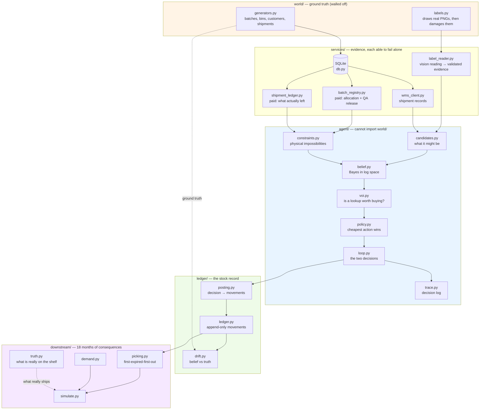
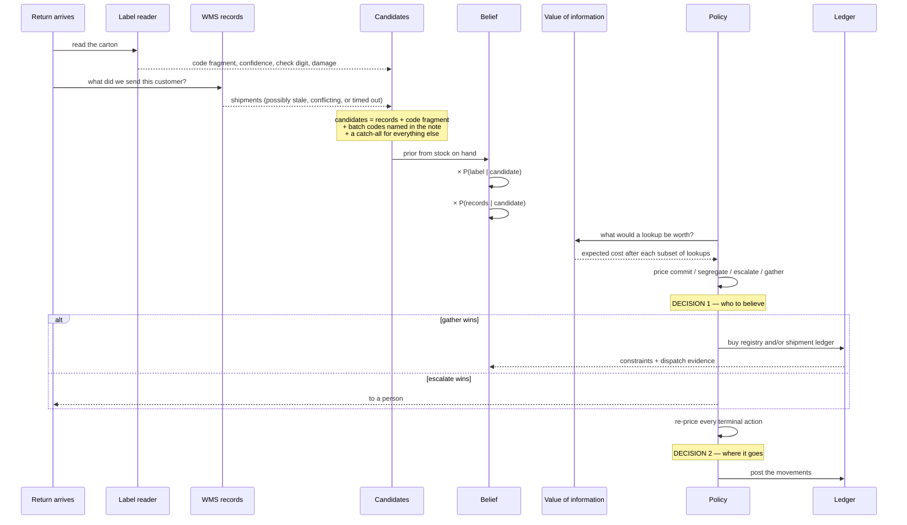
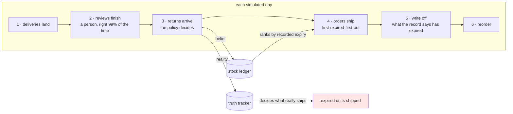

# RECONCILE — deciding what a returned carton actually is

**Repo:** `LEC_AI` · **Brief:** [objectives.md](./objectives.md) · **Plan:** [PLAN.md](./PLAN.md)
· **Progress:** [status.md](./status.md) · **Demo guide:** [demo/GUIDE.md](./demo/GUIDE.md)
· **Design options:** [architecture-options.md](./architecture-options.md)
· **Where the model is used:** [llm-integration.md](./llm-integration.md)

```bash
uv sync --extra dev --extra demo
uv run pytest                              # 690 tests
uv run streamlit run demo/app.py           # the screen
uv run python -m harness.sweep 2000        # the agent against cases nobody wrote
uv run python -m harness.counterfactual 600  # the harm, measured
```

---

## 1. The problem

A warehouse gets part of an order back — say 84 tins out of 240. The carton has a label on it:
a batch code, a best-before date, a handwritten note. The warehouse system also has a record of
what it thinks it sent that customer. **Sometimes these disagree.**

Somebody has to decide which to believe, and then decide where the stock goes. If they get the
batch wrong, nothing breaks that day. Months later somebody ships expired baby formula, or the
system runs out of stock without warning.

That delay is the whole problem. **The mistake is invisible at the moment you make it**, so
nothing in the ordinary run of the warehouse ever tells you it happened.

### What this is

An agent that keeps a probability for each possible answer and takes whichever action costs
least in expected pounds. It has four:

| Action | What it does |
|---|---|
| **Commit** | File the stock to a shelf under a named batch |
| **Gather** | Pay a small fee to look up an external record |
| **Segregate** | Hold it back under the earliest expiry it could possibly have |
| **Escalate** | Hand it to a person |

Nothing is hardcoded. There is no `else` branch: every action, escalation included, is priced
and compared, and the cheapest wins.

### Objectives

| # | Requirement | Where it is met |
|---|---|---|
| R1 | Two decisions in sequence, the second using the first | `agent/loop.py`; both appear in every trace |
| R2 | Real alternatives chosen at runtime, not a script | `test_agent.py::test_no_default_branch` — editing the cost file flips the action on identical evidence |
| R3 | Two independently failing components | `services/label_reader.py`, `services/wms_client.py`, each with its own fault switches |
| R4 | Work out which source is broken, no default | Source failure is a latent variable inside the likelihood, not a filter |
| R5 | Unreadable labels *and* readable-but-contradicted ones | Cases S2/S3 and S4/S8 |
| R6 | Trust, pay to check, or escalate | All four actions win somewhere |
| R7 | Assign stock without causing drift | `ledger/` — append-only, reversible, drift measured against truth |
| R8 | Prove the harm, measured | 600 paired 540-day simulations: **24% fewer expired units** than trusting the label |
| R9 | Working code | 690 tests, ruff and mypy strict clean, runs offline |
| R10 | A case where the obvious answer is wrong | S4, and the demo says so on screen |

---

## 2. End-to-end architecture



**The wall matters more than anything else here.** `agent/` cannot import `world/`, and neither
can `ledger/`. Both are enforced by a test that parses the imports. Without it, every harm
number in this repo would be unfalsifiable — the agent could read the answer, and a drift of
zero would mean nothing because both sides of the comparison would come from the same place.
`ledger/drift.py` and `downstream/` are the only places the two sides meet, which is exactly
why they are separate files.

### 2.1 The world

`world/generators.py` builds one fixed, hand-checkable warehouse: 5 batches of one product,
8 bins including a goods-in bin, a hold area and a quarantine area, 4 customers (one of which
repacks goods — that is the one whose labels lie), 8 shipments and 8 return events.

Those 8 returns give **12 cases**: S1–S8 use one each, and the four `X-` cases replay `RET-S1`
and `RET-S4` with a different service knocked out. So a source failure is tested against a
return whose correct answer is already known from the undamaged run, which is what makes "the
agent still resolved it" mean something.

`world/labels.py` draws each carton label as a **real PNG and then damages it** — glare, blur,
smear, a torn corner, ink bleed. The damage is genuine image damage, not a flag on a data
structure, so whatever reads it has to cope with characters that are actually missing.

Batch codes carry a **GS1-style check digit**: `B-2288` prints as `B-2288-0`, where the last
digit is computed from the others. That is what lets the agent tell "I misread a character"
apart from "this label genuinely says something else". Changing any single body digit always
breaks the check digit — verified exhaustively — which is why case S6 is a physical tear rather
than a misread.

### 2.2 How a decision is made



**Source failure is inside the sum, not a filter in front of it.** The likelihood marginalises
over what the source might be doing:

```
P(evidence | candidate) = Σ over source states  P(state | symptoms) × P(evidence | candidate, state)
```

A label can be in one of three states — read correctly, misread, or *genuinely correct but on
the wrong box* (a reused outer carton). That third state is what lets the agent say "this label
is perfectly legible, and I still do not believe it", which is the hero case.

### 2.3 Where the model is used

Two calls, both `claude-sonnet-5`, and **neither runs when the agent runs**:

| Call site | Input | What it returns |
|---|---|---|
| `services/label_reader.py` | the carton photo | which characters are legible, whether the code is complete, a confidence, the best-before date, the physical condition |
| `agent/notes.py` | the handwritten condition note | print dates, **any lot code written out in prose**, and three flags: repacked, mixed pallet, off-site origin |

Both are reached only by `services/record_readings.py`, an offline recorder. Everything else —
tests, demo, sweeps, simulation — replays the recordings in `tests/cassettes/`, keyed by the
sha256 of the image bytes or the note text. Change an image and its recording no longer
matches, so the reader raises rather than quietly returning a stale answer. A test replaces
`anthropic.Anthropic` with a class that raises on construction and runs every case, so "no
model at runtime" is verified rather than asserted. **No API key is stored anywhere.**

The split is **the model perceives and interprets; plain code decides**, and it is enforced
structurally rather than by discipline: `LabelReading` and `NoteFacts` have no field in which a
judgement could be expressed. There is nowhere for the model to say which batch it thinks the
stock is, or what should be done. Even a drifting prompt could not carry the answer.

**What the model contributes that a database query cannot.** A warehouse note saying
*"cross-docked from the Halden depot, inner cases stamped B-2296"* is prose. No `SELECT` will
ever find that code. The model reads it out; `agent/candidates.py` checks it against the real
batch list before it becomes a candidate, so an invented code cannot win; and
`agent/notes.py::note_code_likelihood` then treats it as evidence for that batch at 16:1.

That path is measured, not assumed. Over 600 generated cases that contained a lot code in the
note, removing the model's extraction changes the decision on a large share of them, and the
agent gets more of them right with it than without. `agent/candidates.py` itself contains no
model call — it consumes `NoteFacts` — which is the point of the split, but it does mean the
contribution has to be measured end to end rather than inferred from the code.

### 2.4 The stock ledger

Append-only, enforced by SQLite triggers rather than good intentions: `UPDATE` and `DELETE`
abort. Two ideas do the work:

- **Movements are transfers, not adjustments.** Every row moves a positive quantity from one
  place to another, and places outside the warehouse (`@customer`, `@dispatch`, `@scrap`) are
  named. "Units in equals units out" is then true by construction.
- **A position is a lot at a location**, where a lot is what we *believe* the units are.
  Changing our mind is therefore a move between positions — an event in the log with a decision
  attached, not a silent overwrite.

Every return produces exactly two rows: a receipt into goods-in as unidentified stock, then the
placement. **Escalations post too** — stock a person is looking at is real stock in a real
place.

---

## 3. The simulation

The harm argument cannot rest on an anecdote, so six policies are run through the same
eighteen months, on the same warehouses, with the same demand and the same returns.



**The mechanism is in step 4.** Picking ranks stock by the expiry *the record says*. What
physically leaves is whatever is actually in that location. Stock recorded as lasting longer
than it really does sinks to the back of the queue, waits, and ships after it has gone off.
Nothing malfunctions at any point — the picker is doing its job correctly on a wrong number.

Two things are never picked, and the cost model depends on both: **stock with no recorded
expiry** (first-expired-first-out cannot rank what it cannot date) and **non-active bins**.

### 3.1 Running it

```bash
uv run python -m harness.counterfactual 600
```

The comparison is **paired**: for a given seed every policy gets the same warehouse, the same
demand, the same returns and the same faults, so the only difference is what was decided. The
variation between seeds is far larger than the difference between policies, so an unpaired
comparison would bury the effect. There is a test asserting the pairing holds, because it broke
once and the results still looked plausible.

Confidence intervals are bootstrapped over seeds rather than assumed normal — the per-seed harm
is heavily skewed, and a normal interval would be wrong in the direction that flatters the
result.

### 3.2 Results — 600 seeds, 540 days each

| policy | expired units shipped | £ per run | £ above the floor |
|---|---:|---:|---:|
| **agent** | **284.9** | 152,143 | **15,227** |
| trust the label | 374.3 | 155,671 | 18,755 |
| trust the records | 1,756.8 | 221,091 | 84,175 |
| always escalate | 782.9 | 176,652 | 39,736 |
| always segregate | 128.5 | 211,783 | 74,867 |
| oracle (knows the answer) | 0.0 | 136,916 | 0 |

Paired against each alternative, 95% bootstrap intervals. Negative means the agent is better:

| against | expired units | total £ |
|---|---|---|
| trust the label | **−89.4 [−129.5, −50.6]** | **−3,528 [−5,193, −1,902]** |
| trust the records | −1,472 [−1,681, −1,270] | −68,948 [−76,422, −61,735] |
| always escalate | −498 [−542, −457] | −24,508 [−26,573, −22,571] |
| always segregate | +156 [+119, +194] | −59,640 [−63,304, −55,927] |

**Read the third column, not the second.** The absolute £ figure is ~94% stock written off at
its recorded best-before, and that comes from the **replenishment rule, not from any decision
about a return**: a fixed order-up-to level with no forecasting leaves long-dated stock sitting
behind shorter-dated deliveries in the queue until some of it ages out. Every policy that files
stock pays it within 1%, which is what makes it a floor. Against the part decisions actually
control, the agent is 19% better than trusting the label.

This is why **the oracle costs £136,916 rather than nothing.** It knows the answer, so it ships
zero expired units, escalates nothing and buys no lookups — its entire cost is that same
write-off. "Some cost is unavoidable" means unavoidable *by the identification decision*, which
is the only thing being compared here. It is not a claim that a real warehouse must lose 10% of
its stock; that figure is a property of the simulated inventory policy, and forecasting was
deliberately left out of scope because it has no bearing on whether a batch was identified
correctly.

The one policy that does move the floor is **always segregate**, which writes off 47% more
(18,518 units against 12,551) because holding everything under the earliest expiry any batch
could have means much of it is scrapped before anyone gets round to identifying it. That is a
cost its decisions genuinely cause, and a test keeps the distinction honest.

Two results worth reading carefully:

- **Escalating everything is not safe.** It ships 783 expired units against the agent's 285,
  because a 1% human error rate applied to *every* return beats a larger rate applied only to
  the hard ones. Had review been modelled as a free correct answer, this policy would have been
  unbeatable and the comparison rigged.
- **Segregating everything is safe and useless.** Fewest expired units of any runnable policy,
  and £59,125 more expensive, because held stock is never on a pick face when it is needed.
  Quoting the expiry number alone would make it look like the winner.

### 3.3 Six months was not long enough

The plan assumed a 180-day horizon. That was the biggest flagged risk and it was real:

| horizon | 180d | 270d | 365d | 540d | 730d |
|---|---:|---:|---:|---:|---:|
| expired units, same 8 seeds | 644 | 3,129 | 1,772 | 4,730 | 3,729 |

At 180 days **six of the eight seeds report zero**. A six-month run would have concluded there
was no difference between policies worth having. Being slow is the entire point of this
failure, so the measurement has to outlast it. The horizon is 540 days and a test keeps it
there.

---

## 4. Testing

690 tests. The important distinction is between the two kinds:

| | recorded cases | generated cases |
|---|---|---|
| How many | 12, written by hand | unlimited, from a seed |
| Warehouse, database, services | real | real |
| Label image | rendered PNG, read by a vision model, recorded | constructed, put through the same validation |
| What they prove | perception works; the agent handles what it was shown | the agent handles cases nobody wrote |

**Every bug found in this project hid behind the same thing**: cases written by hand and added
only once the code could already handle them. The generative harness (`harness/`) exists
because of that. It builds fresh worlds from seeds and asserts *properties*, never expected
answers, in two worlds:

- **Calibrated** — faults occur at the rates `config/reliability.yaml` claims. A failure here
  is a reasoning failure.
- **Miscalibrated** — every fault equally likely. Failures there mean the beliefs are wrong,
  which is a different thing, so only the properties that must hold regardless are checked.

```bash
uv run python -m harness.sweep 2000                 # calibrated
uv run python -m harness.sweep 2000 --miscalibrated
uv run python -m harness.calibration                # is it as sure as it should be?
uv run python -m harness.calibration --sweep        # the evidence weight, measured
```

---

## 5. Honest limits

- **The reliability numbers are hand-set.** They are in `config/reliability.yaml` and can be
  argued with, but they are not measured, and they are load-bearing for the hero case. The
  measured cost of this is the gap between 0.20% dangerous outcomes in the calibrated world and
  2.05% in the miscalibrated one.
- **The agent is overconfident by about a factor of two.** It claims a 1.8% error rate and has
  a 3.5% one. The evidence weight improves its *decisions* without fixing this; the fix needs a
  model of which sources share what information, not one scalar.
- **It is risk-neutral.** A certain £4,000 loss and a 1-in-100 chance of £400,000 are the same
  to it. A food business would not agree.
- **Evidence nobody anticipated is ignored.** A temperature log has no likelihood function, so
  it has no effect.
- **Its value has an upper bound in return size.** Above roughly a hundred units on the hero
  case, a person costs less than the risk left after a lookup, so the agent stops buying
  information. Where that point sits is set by `human_error_rate` — another hand-set figure.

---

## 6. Layout

```
world/       ground truth: warehouse, batches, label images   (agent/ must not import)
services/    evidence sources, each able to fail on its own
agent/       candidates, belief, constraints, value of information, policy, loop, trace
ledger/      append-only stock movements, and drift against truth
downstream/  demand, first-expired-first-out picking, the 540-day simulation
harness/     generated cases, properties, sweeps, policies, the counterfactual
demo/        the screen (panels.py holds the arithmetic, app.py only renders)
config/      cost basis, reliability counts, the 12 recorded cases
artifacts/   label images, decision traces, committed harm figures
```
