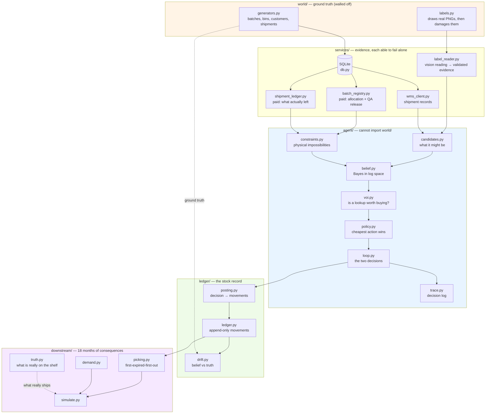
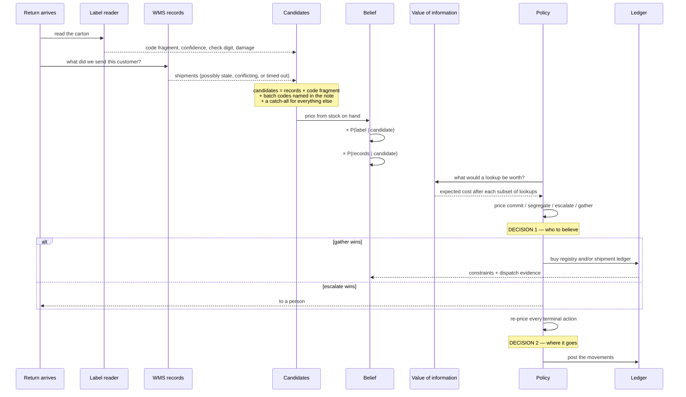
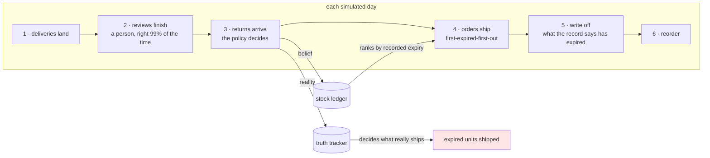

# RECONCILE — deciding what a returned carton actually is

**Repo:** `LEC_AI` · **Brief:** [objectives.md](./objectives.md) · **Initial plan:** [PLAN.md](./PLAN.md)
· **Progress:** [status.md](./status.md) · **Demo guide:** [demo/GUIDE.md](./demo/GUIDE.md)
· **Design option discussion and decision:** [architecture-options.md](./architecture-options.md)
· **Where the model is used:** [llm-integration.md](./llm-integration.md)

A warehouse gets part of an order back. The carton's label and the warehouse system disagree
about which batch it is, and somebody has to decide who to believe. Get it wrong and nothing
breaks today — months later you ship expired stock.

**RECONCILE** keeps a probability for each possible answer and takes whichever action costs
least in expected pounds: file it, pay for a lookup, hold it back, or hand it to a person.
Over 600 simulated runs of eighteen months it ships **25% fewer expired units** than trusting
the label, with a confidence interval that excludes zero.

---

## 0. Running it

```bash
uv sync --extra dev --extra demo     # dev = tests and linting, demo = the screen
uv run python -m demo.run S4         # start here
```

Everything runs offline except the last command in the table, which is the only one that calls
a model or needs an API key.

| Command | What it does |
|---|---|
| `python -m demo.run S4` | The agent on one return, in the terminal: the label reading, the probabilities after each piece of evidence with what it would do at that point, both decisions with every option priced, and the outcome against the truth. **Start here.** |
| `python -m demo.run --list` | The twelve recorded cases |
| `python -m demo.run --seed 418` | A case generated on the spot, that nobody wrote |
| `streamlit run demo/app.py` | The same walkthrough with pictures. Reading guide: [demo/GUIDE.md](./demo/GUIDE.md) |
| `python -m demo.flip` | Runs one case three times, changing a single cost figure. The chosen action changes with it — the demonstration that there is no hardcoded fallback |
| `python -m harness.sweep 2000` | The agent against 2,000 cases nobody wrote. Add `--miscalibrated` for a world whose fault rates the agent does not believe. About a minute |
| `python -m harness.calibration` | Is it as sure as it should be? Add `--sweep` for the evidence weight against realised cost |
| `python -m harness.counterfactual 600` | The harm: six policies through the same 540 days, 600 seeds. Several minutes; committed results in `artifacts/harm.json` |
| `pytest` | 712 tests, about four minutes |
| `ruff check . && ruff format --check . && mypy` | Lint and types |
| `python -m services.record_traces` | Rewrites `artifacts/traces/*.json`. Offline |
| `python -m services.record_readings` | **Needs an API key and network.** Re-reads the label images and notes and rewrites `tests/cassettes/`. Only needed if you change an image or a note |

Prefix each with `uv run`.

## 1. The problem

A warehouse gets part of an order back — say 84 tins out of 240. The carton has a label on it:
a batch code, a best-before date, a handwritten note. The warehouse system also has a record of
what it thinks it sent that customer. **Sometimes these disagree.**

Somebody has to decide which to believe, and then decide where the stock goes. If they get the
batch wrong, nothing breaks that day. Months later somebody ships expired baby formula, or the
system runs out of stock without warning.

That delay is the whole problem. **The mistake is invisible at the moment you make it**, so
nothing in the ordinary run of the warehouse ever tells you it happened.

### What this is

An agent that keeps a probability for each possible answer and takes whichever action costs
least in expected pounds. It has four:

| Action | What it does |
|---|---|
| **Commit** | File the stock to a shelf under a named batch |
| **Gather** | Pay a small fee to look up an external record |
| **Segregate** | Hold it back under the earliest expiry it could possibly have |
| **Escalate** | Hand it to a person |

Nothing is hardcoded. There is no `else` branch: every action, escalation included, is priced
and compared, and the cheapest wins.

### Terms

Only the ones needed to read the rest. `agent/` never sees any of the ground-truth ones.

| Term | Meaning |
|---|---|
| **Batch** | One production run. Every unit in a batch shares a best-before date, so getting the batch wrong gets the expiry wrong |
| **Bin** | A shelf location. Also a holding area and a quarantine area, neither of which is picked from |
| **Check digit** | A last digit computed from the others, so a single misread character makes a code fail validation. It tells "I misread it" apart from "it genuinely says something else" |
| **First-expired-first-out** | The standard picking rule: always ship the stock that expires soonest. This is why a wrong expiry is dangerous — it changes what gets picked, and when |
| **Candidate** | One possible answer, e.g. "this is batch B-2288". Each carries a probability and they add to 1 |
| **Catch-all** | An extra candidate meaning "a batch nobody listed". Without it a confident wrong answer cannot be contradicted |
| **Prior** | What each candidate is worth before any evidence. Here: how much of each batch is in the building |
| **Likelihood** | How well a candidate explains a piece of evidence — P(evidence given candidate). **Not** a probability of the candidate, and it does not add to 1 across candidates |
| **Drift** | The gap between what the stock record says and what is physically there |
| **Unit-days** | Units multiplied by days. 84 units recorded as lasting 166 days longer than they do is 13,944 unit-days of expiry error |
| **Paired comparison** | Every policy gets the same warehouse, demand and returns, so the only difference between them is the decision |

### Objectives

| # | Requirement | Where it is met |
|---|---|---|
| R1 | Two decisions in sequence, the second using the first | `agent/loop.py`; both appear in every trace |
| R2 | Real alternatives chosen at runtime, not a script | `test_agent.py::test_no_default_branch` — editing the cost file flips the action on identical evidence |
| R3 | Two independently failing components | `services/label_reader.py`, `services/wms_client.py`, each with its own fault switches |
| R4 | Work out which source is broken, no default | Source failure is a latent variable inside the likelihood, not a filter |
| R5 | Unreadable labels *and* readable-but-contradicted ones | Cases S2/S3 and S4/S8 |
| R6 | Trust, pay to check, or escalate | All four actions win somewhere |
| R7 | Assign stock without causing drift | `ledger/` — append-only, reversible, drift measured against truth |
| R8 | Prove the harm, measured | 600 paired 540-day simulations: **25% fewer expired units** than trusting the label |
| R9 | Working code | 712 tests, ruff and mypy strict clean, runs offline |
| R10 | A case where the obvious answer is wrong | S4, and the demo says so on screen |

---

## 2. Architecture

### 2.1 Where everything lives

```
world/       ground truth: warehouse, batches, label images   (agent/ must not import)
services/    evidence sources, each able to fail on its own
agent/       candidates, belief, constraints, value of information, policy, loop, trace
ledger/      append-only stock movements, and drift against truth
downstream/  demand, first-expired-first-out picking, the 540-day simulation
harness/     generated cases, properties, sweeps, policies, the counterfactual
demo/        the screen and the terminal walkthrough
common/      batch codes and check digits
config/      cost basis, reliability counts, the 12 recorded cases
tests/       712 tests, and the recorded model readings
artifacts/   label images, decision traces, committed harm figures
```

Two of those boundaries are enforced by tests rather than by convention. **`agent/` and
`ledger/` cannot import `world/`** — if either could read the answers, every harm number here
would be unfalsifiable. `ledger/drift.py` and `downstream/` are the only places the two sides
meet, which is why they are separate files.

### 2.2 How the pieces fit



**The wall matters more than anything else here.** `agent/` cannot import `world/`, and neither
can `ledger/`. Both are enforced by a test that parses the imports. Without it, every harm
number in this repo would be unfalsifiable — the agent could read the answer, and a drift of
zero would mean nothing because both sides of the comparison would come from the same place.
`ledger/drift.py` and `downstream/` are the only places the two sides meet, which is exactly
why they are separate files.

### 2.3 The world

`world/generators.py` builds one fixed, hand-checkable warehouse: 5 batches of one product,
8 bins including a goods-in bin, a hold area and a quarantine area, 4 customers (one of which
repacks goods — that is the one whose labels lie), 8 shipments and 8 return events.

Those 8 returns give **12 cases**: S1–S8 use one each, and the four `X-` cases replay `RET-S1`
and `RET-S4` with a different service knocked out. So a source failure is tested against a
return whose correct answer is already known from the undamaged run, which is what makes "the
agent still resolved it" mean something.

`world/labels.py` draws each carton label as a **real PNG and then damages it** — glare, blur,
smear, a torn corner, ink bleed. The damage is genuine image damage, not a flag on a data
structure, so whatever reads it has to cope with characters that are actually missing.

Batch codes carry a **GS1-style check digit**: `B-2288` prints as `B-2288-0`, where the last
digit is computed from the others. That is what lets the agent tell "I misread a character"
apart from "this label genuinely says something else". Changing any single body digit always
breaks the check digit — verified exhaustively — which is why case S6 is a physical tear rather
than a misread.

### 2.4 How a decision is made



**Source failure is inside the sum, not a filter in front of it.** The likelihood marginalises
over what the source might be doing:

```
P(evidence | candidate) = Σ over source states  P(state | symptoms) × P(evidence | candidate, state)
```

A label can be in one of three states — read correctly, misread, or *genuinely correct but on
the wrong box* (a reused outer carton). That third state is what lets the agent say "this label
is perfectly legible, and I still do not believe it", which is the hero case.

### 2.5 Where the model is used

Two calls, both `claude-sonnet-5`, and **neither runs when the agent runs**:

| Call site | Input | What it returns |
|---|---|---|
| `services/label_reader.py` | the carton photo | which characters are legible, whether the code is complete, a confidence, the best-before date, the physical condition |
| `agent/notes.py` | the handwritten condition note | print dates, **any lot code written out in prose**, and three flags: repacked, mixed pallet, off-site origin |

Both are reached only by `services/record_readings.py`, an offline recorder. Everything else —
tests, demo, sweeps, simulation — replays the recordings in `tests/cassettes/`, keyed by the
sha256 of the image bytes or the note text. Change an image and its recording no longer
matches, so the reader raises rather than quietly returning a stale answer. A test replaces
`anthropic.Anthropic` with a class that raises on construction and runs every case, so "no
model at runtime" is verified rather than asserted. **No API key is stored anywhere.**

The split is **the model perceives and interprets; plain code decides**, and it is enforced
structurally rather than by discipline: `LabelReading` and `NoteFacts` have no field in which a
judgement could be expressed. There is nowhere for the model to say which batch it thinks the
stock is, or what should be done. Even a drifting prompt could not carry the answer.

The demo can **replay any case one source at a time**, pricing every action after each piece of
evidence. On the hero case the leading candidate changes three times — the prior favours the
batch the label claims, the records overturn it, the clean label drags it back, and only the
paid lookup settles it — and the best action changes from escalate to commit at the last step.
That is the "genuinely competing strategies at runtime" requirement as something you can watch.

**What the model contributes that a database query cannot.** A warehouse note saying
*"cross-docked from the Halden depot, inner cases stamped B-2296"* is prose. No `SELECT` will
ever find that code. The model reads it out; `agent/candidates.py` checks it against the real
batch list before it becomes a candidate, so an invented code cannot win; and
`agent/notes.py::note_code_likelihood` then treats it as evidence for that batch at 16:1.

That path is measured, not assumed. Over 600 generated cases that contained a lot code in the
note, removing the model's extraction changes the decision on a large share of them, and the
agent gets more of them right with it than without. `agent/candidates.py` itself contains no
model call — it consumes `NoteFacts` — which is the point of the split, but it does mean the
contribution has to be measured end to end rather than inferred from the code.

### 2.6 The stock ledger

Append-only, enforced by SQLite triggers rather than good intentions: `UPDATE` and `DELETE`
abort. Two ideas do the work:

- **Movements are transfers, not adjustments.** Every row moves a positive quantity from one
  place to another, and places outside the warehouse (`@customer`, `@dispatch`, `@scrap`) are
  named. "Units in equals units out" is then true by construction.
- **A position is a lot at a location**, where a lot is what we *believe* the units are.
  Changing our mind is therefore a move between positions — an event in the log with a decision
  attached, not a silent overwrite.

Every return produces exactly two rows: a receipt into goods-in as unidentified stock, then the
placement. **Escalations post too** — stock a person is looking at is real stock in a real
place.

---

## 3. The simulation

The harm argument cannot rest on an anecdote, so six policies are run through the same
eighteen months, on the same warehouses, with the same demand and the same returns.



**The mechanism is in step 4.** Picking ranks stock by the expiry *the record says*. What
physically leaves is whatever is actually in that location. Stock recorded as lasting longer
than it really does sinks to the back of the queue, waits, and ships after it has gone off.
Nothing malfunctions at any point — the picker is doing its job correctly on a wrong number.

Two things are never picked, and the cost model depends on both: **stock with no recorded
expiry** (first-expired-first-out cannot rank what it cannot date) and **non-active bins**.

### 3.1 How the comparison is made

The comparison is **paired**: for a given seed every policy gets the same warehouse, the same
demand, the same returns and the same faults, so the only difference is what was decided. The
variation between seeds is far larger than the difference between policies, so an unpaired
comparison would bury the effect. There is a test asserting the pairing holds, because it broke
once and the results still looked plausible.

Confidence intervals are bootstrapped over seeds rather than assumed normal — the per-seed harm
is heavily skewed, and a normal interval would be wrong in the direction that flatters the
result.

### 3.2 Results — 600 seeds, 540 days each

| policy | expired units shipped | £ per run | £ above the floor |
|---|---:|---:|---:|
| **agent** | **280.6** | 151,993 | **15,077** |
| trust the label | 374.3 | 155,671 | 18,755 |
| trust the records | 1,756.8 | 221,091 | 84,175 |
| always escalate | 782.9 | 176,652 | 39,736 |
| always segregate | 128.5 | 211,783 | 74,867 |
| oracle (knows the answer) | 0.0 | 136,916 | 0 |

Paired against each alternative, 95% bootstrap intervals. Negative means the agent is better:

| against | expired units | total £ |
|---|---|---|
| trust the label | **−93.7 [−133.1, −56.0]** | **−3,678 [−5,316, −2,108]** |
| trust the records | −1,476 [−1,685, −1,275] | −69,098 [−76,579, −61,917] |
| always escalate | −502 [−546, −462] | −24,658 [−26,736, −22,693] |
| always segregate | +152 [+115, +189] | −59,790 [−63,420, −56,099] |

**Read the last column, not the one before it.** The absolute £ figure is ~94% stock written
off at its recorded best-before, and that comes from the **replenishment rule, not from any
decision about a return**: reordering to a fixed level with no forecasting leaves long-dated
stock behind shorter-dated deliveries until some of it ages out. Every policy that files stock
pays it within 1%, which is what makes it a floor. Against the part decisions control, the
agent is **20% better** than trusting the label.

That floor is also why **the oracle costs £136,916 rather than nothing.** Knowing the answer
removes every expired unit, every escalation and every lookup, and leaves exactly that
write-off. It is not a claim that a real warehouse must lose a tenth of its stock — that is a
property of the simulated inventory policy, and forecasting was left out of scope because it
has no bearing on whether a batch was identified correctly.

One policy does move the floor: **always segregate** writes off 47% more, because dating
everything at the earliest expiry any batch could have scraps much of it before anyone
identifies it. That cost its decisions genuinely cause, and a test keeps the distinction.

Two results worth reading carefully:

- **Escalating everything is not safe.** It ships 783 expired units against the agent's 281,
  because a 1% human error rate applied to *every* return beats a larger rate applied only to
  the hard ones. Had review been modelled as a free correct answer, this policy would have been
  unbeatable and the comparison rigged.
- **Segregating everything is safe and useless.** Fewest expired units of any runnable policy,
  and £59,125 more expensive, because held stock is never on a pick face when it is needed.
  Quoting the expiry number alone would make it look like the winner.

---

## 4. Testing

712 tests. The important distinction is between the two kinds:

| | recorded cases | generated cases |
|---|---|---|
| How many | 12, written by hand | unlimited, from a seed |
| Warehouse, database, services | real | real |
| Label image | rendered PNG, read by a vision model, recorded | constructed, put through the same validation |
| What they prove | perception works; the agent handles what it was shown | the agent handles cases nobody wrote |

**Every bug found in this project hid behind the same thing**: cases written by hand and added
only once the code could already handle them. The generative harness (`harness/`) exists
because of that. It builds fresh worlds from seeds and asserts *properties*, never expected
answers, in two worlds:

- **Calibrated** — faults occur at the rates `config/reliability.yaml` claims. A failure here
  is a reasoning failure.
- **Miscalibrated** — every fault equally likely. Failures there mean the beliefs are wrong,
  which is a different thing, so only the properties that must hold regardless are checked.

---

## 5. Edge cases

Every one of these is exercised by a test, and most were found by the generative sweep or by
probing rather than anticipated. The ten below are the ones where the handling was not obvious;
the rest are in `tests/test_end_to_end.py` and `tests/test_simulation.py`.

| Case | What happens, and why |
|---|---|
| **The batch list is empty** (warehouse system down) | Treated as *no information*, not as "no batch matches". Reading an empty list as a rejection suppressed the reused-box explanation fiftyfold and left the agent 99.996% sure of one unverified reading |
| **No evidence survives at all** | The candidate list is just the catch-all. It still weighs five options and holds the stock (£5.12) rather than escalating (£29.50) — and with no batch list there is no date it can stand behind, so the hold is left *undated*. Undated stock cannot be picked, so being ignorant is safe |
| **Quantity of zero or less** | Refused at the intake boundary. A negative quantity flips the sign of every harm term, so the *most* damaging action becomes the cheapest. At −5 units the hero case filed the stock as the label claimed |
| **The customer repacks** | Their labels are wrong far more often, *and* "you cannot return more than we sent you" stops being a rule, because they merge stock across deliveries. Applying it anyway ruled out the true batch precisely for the customers who make cases hard |
| **Records are stale** | Recent shipments are missing by definition, so the chance the answer is not on the list rises. Ignoring that once had the agent file an impostor at 99.96% |
| **Code is incomplete** (torn corner) | The fragment is used as a prefix, so every known batch whose code starts with it becomes a candidate. Without this the true answer would often never be on the list at all |
| **A code that matches no real batch** | Recorded as rejected, its weight going to the catch-all. An invented or misread code cannot win |
| **The answer appears only in prose** | A note saying *"inner cases stamped B-2296"* is invisible to a database query. The model reads it out, code checks the batch is real, and it becomes a candidate with evidence behind it |
| **Stock held with no expiry date** | Cannot be picked, because first-expired-first-out cannot rank what it cannot date, so it carries no expiry risk. The picker really does skip it and a test says so — the cost model depends on it |
| **Evidence that explains nothing** | Fifty rounds of it still leaves a valid distribution. The arithmetic is in log space with a floor, so nothing underflows |

---

## 6. Key design decisions

Each of these was a choice with a cost. The alternatives considered and why they were rejected
are in [architecture-options.md](./architecture-options.md); this is the short version.

**Keep a distribution, not a best guess.** The agent's output is a probability for every
candidate that sums to one, including a catch-all for "something nobody listed". A single best
guess cannot express "the label is legible and I still do not believe it", which is the entire
problem.

**Every action is priced; the cheapest wins.** There is no `else` branch. Escalating to a human
sits in the same costed list as committing, and wins when it is genuinely cheapest. Editing
`config/harm.yaml` flips the chosen action on identical evidence, which is how the absence of a
hardcoded fallback is proved rather than asserted.

**Source failure is inside the likelihood, not a filter in front of it.** The agent marginalises
over what each source might be doing rather than deciding first whether to trust it. That is
what lets a perfectly legible label be disbelieved.

**The model perceives; code decides — enforced by the type, not by discipline.** `LabelReading`
and `NoteFacts` have no field in which a judgement could be expressed. There is nowhere for the
model to name a batch or an action, so even a drifting prompt could not carry the answer.

**No model call at runtime.** Readings are recorded once, keyed by content hash, and replayed.
The demo runs offline with no key, results are reproducible, and a test replaces
`anthropic.Anthropic` with a class that raises to prove it. The cost is that a re-record is
needed whenever an image changes — deliberate, because a demo that depends on a network call is
a demo that fails while being filmed.

**Ground truth is walled off, and the wall is tested.** Neither `agent/` nor `ledger/` can
import `world/`. Without this every harm number would be unfalsifiable.

**Nothing is ever driven to exactly zero.** Nothing recovers from zero, and the sources that
rule candidates out can themselves be wrong. A broken constraint collapses a candidate to the
chance that source is mistaken, not to nothing.

**Stock movements are transfers, not adjustments**, with places outside the warehouse named
explicitly. "Units in equals units out" is then true by construction rather than by convention.

**Costs are derived from a basis, not typed in.** `config/harm.yaml` holds unit cost, margin,
wage and minutes; `agent/harm.py` derives every figure from them, so changing a wage updates
everything downstream and cannot leave two numbers disagreeing.

**Report break-even, not a sensitivity sweep.** Expected cost is linear in each cost parameter,
so the exact value at which a decision flips can be solved for directly. That is more useful
than sampling around a guess, and it is what the demo's sensitivity table shows.

**Test properties on cases nobody wrote.** See §4 — this is the decision that found most of the
bugs in this repository.

**Discount evidence for not being independent.** Multiplying likelihoods assumes the sources
are independent given the batch, and they are not — a reused box carries a genuine label of a
batch that genuinely went to that customer. Constraints are exempt, because they do not
corroborate anything and already state their own error rate.

**Prove the harm with a paired comparison against real rivals.** Same warehouse, same demand,
same returns for every policy, over eighteen months, with bootstrapped intervals. "Trust the
label" is what warehouses actually do and is right most of the time; beating a straw man would
prove nothing.

---

## 7. What it does not do, and what I would do next

Each limitation with the fix I would actually reach for, in the order I would do them.

| Limitation | What I would do |
|---|---|
| **Overconfident by about a factor of two.** It claims a 1.8% error rate and has a 3.5% one. The evidence weight improves its *decisions* without fixing this | Model *which* sources share *what* information. A reused box, a stale replica and a repacking customer are not independent symptoms — they are three views of one state. That is a joint likelihood, not the single scalar it uses now, and it is the change most likely to move every number here |
| **The reliability figures are hand-set**, in `config/reliability.yaml`. Arguable, unmeasured, and load-bearing. The measured cost is the gap between 0.20% dangerous outcomes in the calibrated world and 2.05% in the miscalibrated one | Learn them. They are already stored as counts precisely so they *could* update as returns resolve, and nothing does it. Every escalation is a labelled example arriving for free |
| **It is risk-neutral.** A certain £4,000 loss and a 1-in-100 chance of £400,000 are the same to it | Weight the tail. A small change to the same arithmetic, and I would want it before anyone acted on the output |
| **Its value has a ceiling in return size.** Above roughly a hundred units a person costs less than the risk left after a lookup, so it stops buying information. Where that sits is set by `human_error_rate` — another hand-set number | Falls out of learning the reliability figures above, plus a better model of what a reviewer actually costs at volume |
| **Evidence nobody anticipated is ignored.** A temperature log has no likelihood function, so it has no effect | A way to take a new source without rebuilding the belief. The deliberate trade was a testable design over a more capable untested one |
| **Perception rests on eight recorded readings**, only one of which contains a lot code. The *use* of an extracted code is measured across hundreds of generated cases; the extraction itself is not | More images and notes, and a second reader that fails differently, so the reliability model earns its buckets |
| **A return cannot split across two batches.** Real partial returns often do | Relax it. This changes the candidate space rather than the plumbing, which is why it was cut — a real limitation rather than an oversight |
| **The absolute pound figures are not a business case.** They are dominated by write-off from a replenishment rule with no forecasting | Add a demand forecast, so the numbers mean something without being quoted above a floor |
