# Agent architectures: options, trade-offs and failure modes

**Repo:** `LEC_AI` · **Plan:** [PLAN.md](./PLAN.md) · **Progress:** [status.md](./status.md)

Phases P0–P2 built the world around the agent: the warehouse, the damaged labels, the two
evidence sources and the paid lookups. None of that commits us to a particular agent
design. This document lays out the options before P3 fixes one in code.

---

## 1. The thesis

Every design has judgement in it somewhere that cannot be derived from the data:

| Design | Where the judgement sits |
|---|---|
| Bayesian | The likelihood numbers and the priors |
| Prompt-driven | The wording of the prompt |
| Learned | The training set and its labels |
| Rules | The thresholds and the branch order |
| Constraint-based | Which facts are treated as hard |

You cannot remove it. **You can only choose whether it is written down somewhere a
reviewer can point at and argue with.** That is the axis this whole document turns on, and
it is also what the brief is really testing: "no fallback to a default choice" is a demand
that the choice be visible, and "prove the harm is real" is a demand that the judgement be
checkable against outcomes.

A second thesis, specific to this problem: **the hero case is designed to punish
confidence.** The label is crisp, valid and wrong. Any architecture whose failure mode is
"trusts the strongest-looking signal" fails this problem, no matter how sophisticated it
looks. That gives us a sharp test to run every candidate against (§7).

---

## 2. What the agent actually has to do

Stripped of the story, the problem is:

- **Input:** two pieces of evidence, each of which may be absent, degraded or confidently
  wrong; free text; and a set of records that may be stale.
- **Available actions:** commit to a bin, buy one of three lookups (£0.10–£0.40 each),
  segregate under a conservative expiry, or escalate to a human (£14).
- **Output:** a bin assignment, or a hand-off.
- **Cost structure:** wildly asymmetric. Shipping a unit past its real best-before is £48;
  a lookup is £0.30. The ratio is roughly 160:1, so information is nearly free relative to
  being wrong.
- **Hard requirements from the brief:** two sequential decisions, competing strategies
  chosen at runtime, reasoning about *which* source failed, no default branch, and
  measurable downstream harm.

Two properties of this problem shape everything below.

**It is a sequential information-gathering problem, not a classification problem.** The
interesting decision is not "which batch" but "is it worth £0.30 to find out". A design
that only outputs a label, however accurately, has not addressed the actual task.

**The cost asymmetry is extreme.** With a 160:1 ratio, almost any belief state that is not
near-certain justifies buying more evidence. This makes the agent's behaviour easy to get
directionally right and hard to get precisely right — and it means an architecture that
cannot represent cost at all (rules, most pure-LLM setups) is guessing at the one thing
that matters most.

---

## 3. The yardstick

Every option below is scored on these. The first four are hard requirements from the brief;
the rest are how we tell a good implementation from a bad one.

| # | Criterion | Why it matters |
|---|---|---|
| C1 | Can it pick between genuinely competing actions at runtime? | Brief requirement |
| C2 | Can we *prove* there is no default branch? | Brief requirement |
| C3 | Can it reason about which source failed? | Brief requirement |
| C4 | Does it handle both failure modes (unreadable, and readable-but-conflicting)? | Brief requirement |
| C5 | Reproducible — same input, same action, every time? | The video and the harm measurement both depend on it |
| C6 | Auditable — can a reviewer check one decision without rerunning it? | This is how we demonstrate C2 |
| C7 | Testable — can we sweep the space of belief states? | Otherwise we only know it works on six cases |
| C8 | Calibrated — do stated confidences match reality? | Every pound figure is built on them |
| C9 | Cost-aware — does it weigh £0.30 against £4,032? | The core of the task |
| C10 | Build effort and demo quality | We have ~5 days and 3 minutes of video |

---

## 4. The design space

An "architecture" is not one choice but three, and they are largely independent. Most
discussion of agent design collapses them, which is why comparisons usually go nowhere.

```mermaid
flowchart LR
    subgraph A["Axis 1 - How uncertainty is held"]
        A1["single best guess"]
        A2["ranked list"]
        A3["probability distribution"]
        A4["belief functions"]
        A5["constraint set"]
        A6["conformal set"]
    end
    subgraph B["Axis 2 - How belief becomes action"]
        B1["fixed sequence"]
        B2["confidence threshold"]
        B3["expected cost"]
        B4["expected cost + lookahead"]
        B5["worst case"]
        B6["learned policy"]
    end
    subgraph C["Axis 3 - Who does what"]
        C1["LLM does everything"]
        C2["LLM perceives + generates"]
        C3["LLM also estimates numbers"]
        C4["LLM verifies only"]
        C5["no LLM"]
    end
    A --> B --> C
```



Our current design is one point: probability distribution → expected cost with one-step
lookahead → LLM perceives and generates candidates. Sections 5–7 take each axis in turn.

---

## 5. Axis 1 — how uncertainty is held

### 5.1 Single best guess

Pick the most likely batch and go.

**Failure modes.** There is no way to express "I am not sure", so escalation has to be
triggered by something outside the belief — a hardcoded rule, which is a default branch.
Fails C1, C2 and C9 outright. The hero case is fatal: the best guess from the label is
B-2291, and nothing in the representation can say "but only 32%".

Not viable. Listed because it is what a naive implementation does by accident.

### 5.2 Ranked list with scores

An ordered list of candidates with unnormalised scores.

**Pros.** Simple, cheap, no need for likelihoods to be coherent. Enough to say "these two
are close".

**Failure modes.** Scores are not probabilities, so multiplying them by pound costs is
meaningless — you can rank actions but not price them. The gap between first and second
place is not interpretable, so any threshold on it is arbitrary. Silently fails C8 and C9
while looking like it works, which is worse than failing loudly.

### 5.3 Probability distribution (current choice)

A probability per candidate, summing to 1, updated by Bayes.

**Pros.** Multiplies directly with the cost table, so expected costs are real pounds.
Composes cleanly as evidence arrives, and order does not matter. Calibration is measurable.
Handles "the source itself may be broken" by treating source state as part of the model
rather than as a filter applied beforehand.

**Failure modes** — five real ones, in rough order of how much they worry me:

1. **Likelihood specification is where all the judgement hides.** The numbers 0.056 and
   0.83 in the worked example were chosen by me. They are defensible and written down, but
   they are not measured. Bad likelihoods produce confidently wrong posteriors, and the
   confidence is what makes it dangerous.
2. **The hypothesis space must be complete.** A candidate that was never enumerated has
   probability zero forever. The "none of the above" catch-all softens this — a high
   catch-all is a signal to escalate — but it cannot tell you *what* you missed.
3. **Conditional independence is assumed and is sometimes false.** We treat the label and
   the records as independent given the true batch. A common cause that corrupts both (a
   botched data migration that relabels stock *and* rewrites records) breaks that, and the
   agent will be doubly confident in the wrong answer. Our S5 is a mild version: the
   customer's repacking operation influences both what is on the box and what the customer
   reports.
4. **Evidence double-counting.** The registry's allocation history and the shipment
   ledger's door scans both derive from the same underlying dispatch events. Treating them
   as two independent pieces of evidence overstates confidence. This is a live bug risk in
   our current design and needs an explicit guard.
5. **Numerical underflow.** Chains of small likelihoods need log-space arithmetic. Minor,
   but it bites silently.

### 5.4 Belief functions (Dempster-Shafer)

Assign belief mass to *sets* of candidates, so "I have no idea" is representable as mass on
the whole set — genuinely different from "50/50".

**Pros.** The distinction is real and useful here. In S3 (nothing legible, three candidate
batches) a probability distribution gives something flattish, which looks like weak
knowledge; belief functions would say plainly "almost all my mass is on 'don't know'". That
maps beautifully onto the escalate decision: escalate on high ignorance, not on low
maximum probability.

**Failure modes.**

1. **Dempster's combination rule misbehaves precisely on conflicting evidence.** The
   classic counterexample: two sources that strongly disagree can produce a combined belief
   concentrated on a candidate that both sources thought was almost impossible. Our S4 and
   S5 *are* strongly-conflicting-evidence cases. This is not a theoretical concern; it is
   the exact regime we operate in.
2. Decision theory over belief functions is contested — there is no single agreed way to
   turn belief mass into an expected cost, so C9 gets murky.
3. Far harder to explain in a 3-minute video than "multiply and renormalise".

**Verdict.** Intellectually the right tool for the escalate decision, the wrong tool for
the conflict cases, which are the ones the brief cares about. We can capture most of the
benefit inside a probabilistic design by watching the catch-all candidate's mass, which is
a rough proxy for ignorance.

### 5.5 Constraint set

Encode hard facts as constraints — a batch cannot ship before quality release, the visible
code fragment must match, returned quantity cannot exceed shipped quantity — and enumerate
the assignments that survive.

**Pros.** This is exactly what cracks the hero case. B-2291's quality release date being
after the shipment left is not a soft probabilistic hint; it is a physical impossibility.
Expressing it as a likelihood of 0.02 understates it and buries it among numbers that were
chosen by hand. A constraint layer is also trivially auditable and needs no tuning.

**Failure modes.**

1. **No notion of degree.** When two assignments survive, it cannot rank them. S6 (two
   plausible batches, nothing to separate them) ends with a shrug.
2. **Cannot use soft evidence.** "Confidence 0.62" has no place in a constraint system.
3. **Over-constraining returns the empty set** exactly when data is noisy — which is
   exactly when you need an answer. An incorrect constraint silently eliminates the truth,
   and unlike a bad likelihood, there is no way to recover from it.

**Verdict.** Excellent as a *layer*, not as the whole architecture. See §9.

### 5.6 Conformal prediction sets

Produce a set of candidates with a guaranteed error rate: "the true batch is in this set at
least 95% of the time", where the guarantee is distribution-free and comes from a
calibration set rather than from modelling assumptions.

**Pros.** The most rigorous available answer to "how do we know the confidence is real".
The guarantee does not depend on our likelihoods being right — a genuinely different kind of
claim from anything else here. And crucially, **we can actually build the calibration set**:
we have a simulator with ground truth, so we can generate thousands of returns, score them,
and calibrate properly. Most projects cannot do this; we can.

**Failure modes.**

1. The guarantee is *marginal* — it holds on average across cases, not for any individual
   case. A reviewer who reads it as a per-decision guarantee has been misled.
2. It produces a set, not a distribution, so expected-cost arithmetic needs adapting.
3. The calibration set has to resemble live data. Ours would be generated by the same
   scenario code the agent is tested on, which risks measuring our own assumptions back at
   us.

**Verdict.** Not a replacement for the probability distribution, but a strong addition:
use conformal calibration to *set the commit threshold* with a guaranteed error rate,
rather than letting it fall out of hand-set numbers. Recommended in §9.

---

## 6. Axis 2 — how belief becomes an action

This is where the brief's hardest requirement lives. Note that several of these methods
cannot satisfy "no default branch" even in principle.

| Method | How it picks | Handles no-default? | Main failure mode |
|---|---|---|---|
| Fixed sequence | Runs a script | **No** — it *is* the default | Cannot adapt; fails C1 outright |
| Confidence threshold | Commit if p > k, else escalate | **No** — "else" is literally a default | k is arbitrary and cost-blind |
| Expected cost | Cheapest action in pounds | Yes | Inherits every error in the cost table |
| Expected cost + one-step lookahead *(current)* | As above, plus "is a lookup worth buying" | Yes | Myopia (below) |
| Exhaustive-subset lookahead | Considers every combination of lookups | Yes | Cost grows with tool count; fine at 3 |
| Worst case / minimax | Minimises the worst outcome | Yes | Pathologically cautious |
| Risk-averse (CVaR) | Weights the bad tail | Yes | One more parameter to justify |
| Learned policy | Predicts the best action | **No** — black box | No training data; unprovable |

### 6.1 Confidence thresholds — why they fail here

"Commit if above 90%, otherwise escalate" is the intuitive design and it is wrong for a
specific, demonstrable reason: it cannot distinguish a 91% where being wrong costs £4,032
from a 91% where being wrong costs £11. In this problem those two situations both occur, and
they call for opposite actions. The threshold also has to come from somewhere, and wherever
it comes from is an unexamined judgement — the exact thing §1 says to avoid.

### 6.2 Expected cost — the current core

For each action, sum over candidates: probability × harm if we take this action and that
candidate is true. Add the action's own price. Pick the smallest.

**Pros.** Actions are priced in the same units as outcomes, so the comparison is meaningful.
The decision is a table a reviewer can check by hand. Changing the cost file changes the
decision, which is how we *prove* nothing is hardcoded. Escalation competes on price like
everything else rather than being an exception path.

**Failure modes.**

1. **It is only as good as the cost table.** £48 for shipping an expired unit is my
   estimate. If the true figure is £5, the agent over-buys information; if it is £500, it
   under-escalates. Worth a sensitivity sweep, not just a single run.
2. **Risk-neutral by construction.** It is indifferent between a certain £4,000 loss and a
   1-in-100 chance of £400,000. Real food businesses are not — a single safety incident can
   end a supplier relationship. Our cost table partly hides this by folding recall exposure
   into the per-unit figure.
3. **Assumes the probabilities mean something.** Garbage posteriors produce confident,
   well-formatted, wrong cost tables. Calibration measurement is not optional.

### 6.3 Myopic vs full lookahead

Our current value-of-information calculation looks one step ahead: for each lookup, what do
we expect to learn, and is that worth the fee?

**The failure mode is specific.** One-step lookahead can reject two lookups that are jointly
decisive but individually weak. Suppose the registry alone shifts belief a little and the
ledger alone shifts it a little, but together they pin the answer — myopic evaluation
prices each at less than its fee and buys neither, then escalates at £14. That is a £13.30
mistake caused purely by the evaluation horizon.

**The fix is cheap here.** With three tools and a budget of three calls there are only eight
subsets. We can evaluate all of them exactly rather than approximating. Full lookahead is
usually intractable; at this scale it is a loop. Recommended in §9.

### 6.4 Worst-case and risk-averse selection

Minimax picks the action whose worst outcome is least bad.

**Failure mode.** It escalates almost everything. The worst case of committing is always
"the stock was the near-expiry batch and someone eats expired formula", which dominates the
£14 of a human review. An agent that escalates every return fails the over-escalation test
in the plan and is useless in practice. Worth knowing because it is the natural instinct
when the stakes are safety-related, and it is wrong.

CVaR (weight only the worst *tail*, not the single worst case) is the defensible middle and
is a small change to the existing arithmetic. Worth trying if the harness shows the agent
being cavalier on rare high-cost cases.

---

## 7. Axis 3 — the split between the model and plain code, as whole architectures

Here are the combinations worth taking seriously, each judged against the yardstick and,
most usefully, against **what it does on the hero case**.

### A. Everything in plain code (rules engine, no model)

**How.** Hand-written branches over the symptoms.

**Pros.** Fully deterministic, zero cost, instant, trivially auditable.

**Failure modes.**
- Cannot read the handwritten note, so it loses the "inner cases show print date 12SEP25"
  corroboration that lifts the hero case from 63% to 87%.
- Cannot judge whether a garbled string is a plausible misread, so S6 is unresolvable.
- Every unanticipated combination of symptoms lands on a branch that does not exist, which
  forces a catch-all — a default branch, failing the brief directly.
- Rule count grows faster than case count and they start to conflict.

**On the hero case.** Its rules would have to say something like "if the check digit is
valid and confidence is high, trust the label" — and it commits to B-2291. Wrong, at £4,032.

**Verdict.** Fails C1, C2 and C4. Useful only as the constraint layer inside something else.

### B. Everything in the model (single LLM agent with tools)

**How.** Give the model the tools and the cost table, let it reason and act in one loop.

**Pros.** Fastest to build. Handles weird inputs gracefully. Needs no hypothesis
engineering. Looks the most "agentic", which has some presentation value.

**Failure modes** — and these are the ones that matter most, because this is the design
most people reach for first:

1. **Not reproducible.** The same return can produce different actions on different runs.
   That breaks the video and, worse, makes the harm measurement meaningless — you cannot
   attribute a cost difference to a policy if the policy is not a function.
2. **The no-default requirement becomes unarguable.** There is no artefact to point at. We
   could ask the model to output its reasoning, but a post-hoc explanation is not evidence
   of the process that produced the action.
3. **Language models are poorly calibrated and anchor on round numbers.** Stated
   confidences cluster at 70/80/90% and do not track real frequencies. Every pound figure
   downstream inherits that.
4. **It over-weights the salient signal.** A crisp, checksum-valid label is exactly the kind
   of evidence a language model finds compelling. This is not a hypothetical: the whole
   hero case is constructed around a signal that *looks* decisive.
5. **Cost reasoning is inconsistent.** It will sometimes weigh £0.30 against £4,032
   correctly and sometimes not, with no way to tell which run you got.
6. **Cannot be swept.** We cannot test its behaviour across the belief space, so we would
   know it works on six cases and nothing more.

**On the hero case.** Genuinely uncertain, which is itself the problem. A capable model
given the repacking hint may well get it right; the same model on another run may commit to
B-2291 because the label is clean. Unreliability is the failure, not incapacity.

**Verdict.** Fails C2, C5, C7 and C8. Fine for a prototype, not defensible as the thing we
measure harm with.

### C. Model perceives, plain code decides — *current design*

**How.** The model reads the image, extracts facts from free text, and proposes candidates.
Plain code holds the probabilities, computes value of information, and picks the action.

**Pros.** Every criterion except build effort. Decisions are a function of the evidence, so
they reproduce. The cost table is a file, so mutating it flips the action and proves nothing
is hardcoded. We can sweep the belief space in tests. Calibration is measurable. Agency is
still real — the model does not choose the action, but the *agent* chooses which tools to
call, when to stop, and whether to escalate, and those choices differ across the six cases.

**Failure modes.**
1. **The likelihoods are hand-set** (§5.3). This is the honest weak point and the one a
   sharp reviewer will press on.
2. **Candidate generation is a single point of failure.** If the model never proposes the
   right batch, no amount of correct arithmetic recovers it. The catch-all detects that
   something is missing but cannot name it.
3. **The split is a judgement call and the boundary can drift.** "Extract facts from the
   note" quietly becomes "decide what the note implies" if the prompt is loose.
4. **It can look less impressive** than an agent that visibly reasons in prose — a
   presentation risk, not a correctness one, and answerable by putting the cost table on
   screen.

**On the hero case.** Works, and works for an inspectable reason: the label evidence
multiplies B-2291 from 3% to 32% and still does not put it in front, because the reliability
model knows this customer's labels are wrong 17% of the time. That number is written down
and can be argued with.

### D. Model estimates the likelihoods, plain code does the arithmetic

**How.** Same skeleton as C, but instead of hand-set likelihoods, the model is asked "how
surprising is this evidence if the true batch were B-2288?" and the code does the rest.

**Pros.** Removes the hand-tuned constants, which is C's main weakness. Adapts to evidence
types nobody anticipated. Keeps the auditable arithmetic and the priced action table.

**Failure modes.**
1. **Uncalibrated and unstable.** Small prompt changes swing the numbers, and the numbers do
   not track real frequencies.
2. **Incoherent.** The model will not respect the constraints a likelihood function should
   obey, so the "probabilities" may not compose correctly across evidence.
3. **Motivated reasoning through the numbers.** This is the subtle one: a model that has
   already formed a view can produce likelihoods that justify it. The audit trail then looks
   rigorous while encoding exactly the bias the arithmetic was supposed to prevent. **This
   is worse than design B**, because B's guessing is at least obvious.

**Verdict.** Tempting and worth *measuring* against C on calibration, but not worth adopting
untested. If the model's likelihoods calibrate as well as the hand-set ones, it is the
better design; if not, we have learned something worth reporting either way.

### E. Model proposes, plain code verifies

**How.** The model produces an answer with cited evidence; a deterministic layer checks each
citation against the services and rejects unsupported claims.

**Pros.** Catches fabrication directly. The verification step is auditable. Keeps the
model's flexibility on messy inputs.

**Failure modes.**
1. **Verification catches false claims, not missing ones.** The model can be verifiably
   correct about every fact it cites and still reach the wrong conclusion by not citing the
   fact that mattered. On the hero case it might correctly cite the valid check digit, the
   clean image and the high confidence — all true — and commit to B-2291.
2. Produces no probability, so there is nothing to price actions with.
3. No principled basis for escalation.

**Verdict.** A good *guard* to layer on top of C, not a core. Cheap to add.

### F. Several models arguing (debate)

**How.** One advocate for the label, one for the records, a judge.

**Pros.** Surfaces the strongest case for each side. Produces the "here is why the obvious
answer is wrong" narrative almost for free, which is genuinely useful for the video.

**Failure modes.**
1. **Rhetorical quality is not truth.** The more articulate advocate wins, and which side
   that is has nothing to do with which is correct.
2. The judge inherits every calibration problem from design B.
3. Three times the cost and latency, still not reproducible.
4. Debaters tend to converge by mimicry rather than by evidence.

**Verdict.** No. Could be added as a presentation layer *narrating* a decision the
deterministic core already made — but then it is a narrator, and we should say so rather
than pretending it decided anything.

### G. Repeated sampling (self-consistency)

**How.** Ask the model N times with variation; use the answer frequencies as probabilities.

**Pros.** Trivial to implement. Some signal about the model's stability.

**Failure modes.**
1. **Frequencies are not probabilities.** They measure how consistent the model is, not how
   likely the world is. A model that is consistently wrong reports high confidence in the
   wrong answer.
2. **It fails the hero case in a specific, predictable way.** The label is crisp and valid,
   so most samples say B-2291, so the "probability" of B-2291 comes out high. The design
   converts a systematic bias into a confident number. This is the worst possible failure:
   wrong *and* well-quantified.
3. N times the cost and latency for a number we cannot trust.

**Verdict.** No. Worth including in this document because it is superficially attractive
and its failure here is instructive.

### H. Learned policy

**How.** Train a classifier or policy on historically resolved returns.

**Pros.** In principle the best answer, and it would remove the hand-set numbers entirely.

**Failure modes.**
1. **No training data.** We would need thousands of resolved returns.
2. **The interesting cases are rare by construction.** A reused-outer-box case might be 1 in
   500. A model trained on the bulk distribution learns "trust the label", which is exactly
   the wrong lesson.
3. Black box, so C2 and C6 fail.
4. Distribution shift as label printing and warehouse practices change.

**Verdict.** No — with one exception. The reliability model *is* a small learned component:
Beta counts per source per symptom, updated as returns resolve. That is the slice of
learning where we have data, where the output is inspectable, and where being wrong degrades
gracefully. We already do it, and that is the right amount.

### I. Cheap-checks-first cascade

**How.** Run cheap deterministic checks; only invoke expensive reasoning if unresolved.

**Pros.** Cost-efficient. S1 resolves with no model call at all.

**Failure modes.**
1. **The cascade order is itself a fixed sequence**, in direct tension with the brief.
2. **The early exit is exactly how the hero case goes wrong.** Every cheap check on S4 is
   green: the code is well formed, the check digit is valid, confidence is 0.96, the image
   is clean. A cascade commits at step one, having never looked at the warehouse records
   that contradict it. The optimisation and the failure are the same mechanism.

**Verdict.** No as an architecture. The underlying instinct — don't pay for evidence you
don't need — is right, and it is already handled properly by the value-of-information
calculation, which skips the lookups on S1 *because they aren't worth it*, not because a
cheap check fired first.

---

## 8. Failure modes no architecture fixes

Worth writing down because they are easy to miss while comparing designs.

| Risk | Why it survives any architecture | Mitigation |
|---|---|---|
| **Hypothesis space incomplete** | If the truth is never a candidate, no method finds it | Catch-all candidate; alarm when its mass is high |
| **Ground truth leaks into the agent** | Makes every harm number meaningless regardless of design | Import-boundary test (already built) |
| **Cost table is wrong** | Every action choice inherits it | Sensitivity sweep across plausible values |
| **Reliability priors are wrong** | Skews which source gets believed | Calibration diagram; warm-start from an inspectable history |
| **Correlated source failures** | Breaks the independence any fusion method assumes | Model a shared-cause candidate explicitly |
| **Evidence double-counting** | Registry and ledger derive from the same dispatch events | Treat them as one evidence channel, not two |
| **Overfitting to six scenarios** | Six cases can be passed by accident | Randomised case generation; report on unseen seeds |

The last two deserve emphasis. **Double-counting is a live bug risk in the current design** —
the registry's allocation history and the ledger's door scans are not independent, and
multiplying both into the posterior would overstate confidence exactly when the agent is
about to commit. And **six scenarios is a small number**; the harness in P6 should generate
randomised variants so we are measuring the design rather than our own test cases.

---

## 9. Recommendation

**Keep design C** — model perceives, plain code decides. It is the only option that
satisfies all four hard requirements from the brief while remaining measurable, and its main
weakness (hand-set likelihoods) is addressable rather than structural.

Four changes, in priority order:

1. **Add a hard-constraint layer before the probability update.** Physical impossibilities
   — a batch that had not cleared quality control when the shipment left, a quantity larger
   than was ever shipped, a code fragment that does not match — should be expressed as
   constraints, not buried in hand-chosen likelihoods. Keeping them separate makes the hero
   case's reasoning legible on camera, and removes three of the most arbitrary numbers.
   *One important subtlety:* a violated constraint must not set a candidate to exactly zero,
   because nothing recovers from zero and the registry itself can be wrong. It should
   collapse to the probability that the constraining source is mistaken — small, but not
   nothing.

2. **Replace one-step lookahead with exhaustive-subset lookahead.** Eight subsets of three
   tools; evaluate all of them. Removes the myopia failure in §6.3 for the cost of a loop.

3. **Guard against evidence double-counting.** Registry allocations and ledger scans derive
   from the same events. Fuse them into a single dispatch-evidence channel rather than
   multiplying both.

4. **Use conformal calibration to set the commit threshold.** We have a simulator with
   ground truth, so we can generate a proper calibration set and get a guaranteed error rate
   rather than one that falls out of hand-set numbers. This directly answers "how do you
   know your 87% is real", which is the sharpest question a reviewer can ask.

**One experiment worth running (design D):** have the model estimate likelihoods and compare
its calibration against the hand-set ones on the same cases. If it calibrates as well, it is
the better design because the constants disappear. If it does not, we report the comparison
— a negative result here is genuinely interesting and cheap to obtain.

**Explicitly not building:** debate (rhetoric is not evidence), belief functions (misbehave
on conflicting evidence, which is our whole problem), full sequential planning (overkill at
three tools), self-consistency sampling (converts bias into confident numbers), a learned
policy (no data, and the rare cases are the point).

---

## 10. Summary table

| Design | C1 compete | C2 no default | C3 which failed | C5 reproducible | C6 auditable | C9 cost-aware | Hero case |
|---|:--:|:--:|:--:|:--:|:--:|:--:|---|
| A. Rules only | ✗ | ✗ | partial | ✓ | ✓ | ✗ | **Commits to B-2291** |
| B. Model only | ✓ | ✗ | ✓ | ✗ | ✗ | partial | Unreliable |
| **C. Model perceives, code decides** | ✓ | ✓ | ✓ | ✓ | ✓ | ✓ | **Correct, for an inspectable reason** |
| D. Model estimates likelihoods | ✓ | ✓ | ✓ | ✗ | partial | ✓ | Probably correct, unstably |
| E. Propose and verify | partial | ✗ | partial | ✗ | ✓ | ✗ | May commit to B-2291 with valid citations |
| F. Debate | ✓ | ✗ | ✓ | ✗ | partial | ✗ | Depends who argues better |
| G. Repeated sampling | partial | ✗ | ✗ | partial | ✗ | ✗ | **Confidently wrong** |
| H. Learned policy | ✓ | ✗ | partial | ✓ | ✗ | partial | Learns "trust the label" |
| I. Cascade | ✗ | ✗ | partial | ✓ | ✓ | partial | **Commits at the first green check** |

The pattern in the last column is the point of this whole document. Four of the nine designs
fail the hero case in a *predictable* way, and in every one of those it is the same
mechanism: they treat the strongest-looking signal as the most trustworthy one. The design
that survives is the one that separates "how clear is this evidence" from "how much do I
trust the process that produced it" — and can show its working for both.

---

## 11. Auditing the recommendation

Section 9 recommends four changes. This section checks whether they actually do what §7
implies, and it is deliberately unkind to them.

### 11.1 Which advantages of the rejected designs do we actually get?

| From | The advantage | Do we get it? |
|---|---|---|
| Rules only | Deterministic, auditable | **Yes** — the decision core is plain code |
| Rules only | Zero-cost path for trivial cases | **No** — see 11.2, and there is a good reason |
| Constraint set | Hard impossibilities handled structurally | **Yes** — change 1 |
| Constraint set | No tuning needed for those facts | **Yes** — removes three hand-set numbers |
| Conformal | Guaranteed error rate | **Yes** — change 4 |
| Belief functions | Separates "don't know" from "50/50" | **Partly** — see 11.3 |
| Model only | Copes with evidence we did not anticipate | **No** — the real gap, see 11.4 |
| Model estimates likelihoods | No hand-set constants | **No** — only as an experiment |
| Propose and verify | Catches fabricated answers | **Partly** — needs one cheap addition, 11.5 |
| Repeated sampling | Measures how stable a reading is | **No** — but worth taking narrowly, 11.6 |
| Learned policy | Numbers come from data | **Yes, in the one slice we have data** — reliability counts |
| Cascade | Do not pay for evidence you do not need | **Yes** — that is what value of information does |
| Debate | Produces the "why the obvious answer loses" story | **Yes, by other means** — the cost table is the story |

Seven of thirteen are captured, two partly, four not. The four gaps are worked through below.

### 11.2 The missing fast path, and why it is fine

A rules engine resolves a clean case with no model call at all. We cannot, because reading
the printed lot code is the entry point to everything else.

The obvious fix is to decode the barcode instead. It does not work, for a real reason: the
linear barcode on a retail carton encodes the **product**, not the batch. Batch and expiry
need a different symbol (GS1-128 or a 2D code) that these cartons do not carry. So the lot
code is human-readable text, and reading it needs vision.

**This is worth stating in the plan**, because right now our rendered labels draw a barcode
that is purely decorative. A reviewer who assumes it is scannable will ask why we bother
with vision at all. Two things follow: label it as a product barcode in the render, and note
that if it *were* batch-level, cases S2, S3 and S6 would be trivially solvable and the whole
problem would be less interesting.

The cost concern behind the fast path is handled anyway: readings are cached by image hash,
and value of information already skips the paid lookups on clean cases.

### 11.3 "Don't know" versus "50/50" — I was wrong about the fix

Section 5.4 says belief functions distinguish genuine ignorance from a genuine 50/50, and
that we could approximate it by watching the catch-all candidate's mass.

**That approximation does not work, and neither does the obvious alternative.** I tested
measuring how far the posterior moved from the prior, which should be near zero when
evidence taught us nothing:

| Case | How far the posterior moved |
|---|---|
| S3 — nothing legible, three candidates | 0.000 |
| S6 — fragment fits two candidates | 0.012 |

Both are effectively zero, so the measure does not separate them.

**What actually separates them is already in the design.** S3 escalates and S6 gathers not
because their belief states differ much, but because *more evidence would help in S6 and
would not in S3* — which is exactly what the value-of-information calculation computes. The
distinction belongs to action selection, not to the belief representation.

So the honest position: the belief-function advantage does not affect **what the agent
does**. It affects **what the agent reports**. A flat 33/33/33 across three candidates is a
number derived almost entirely from shipment volumes, and presenting it as a confidence is
misleading. That is a reporting problem, and change 4 (conformal calibration) is exactly the
tool that would expose it. No extra mechanism needed — but the trace should say "this is
prior, not evidence" when the evidence moved nothing.

### 11.4 Evidence we did not anticipate — the real gap

If a new kind of evidence arrives — a delivery note photo, a customer email, a temperature
log — the deterministic core has **no slot for it**. There is no likelihood function
defined, so it is silently ignored. A pure model agent would at least use it.

This is the one place where design B is genuinely better than design C, and none of the four
changes fixes it. Two honest options:

1. **Accept it and say so.** The brief defines the evidence sources. Anything else is out of
   scope, and pretending otherwise is scope creep.
2. **Run the design D experiment** (model estimates likelihoods). That is the only route
   that generalises to evidence types nobody wrote a function for.

Recommendation: option 1 for the deliverable, with the experiment run afterwards if time
allows. But it should be named as a known limitation rather than left as an implied
capability.

### 11.5 Fabricated candidates — cheap fix, worth doing

Nothing currently stops the model proposing a batch that does not exist. The constraint
layer catches *impossible* candidates but not *invented* ones.

**Fix:** validate every generated candidate against the batch registry. Anything unknown
does not become a first-class candidate; its mass goes to the catch-all. Small change, and
it captures most of the propose-and-verify advantage.

There is also a free surprise detector already sitting in the arithmetic. If the **best**
likelihood across all candidates is low, then nothing we thought of explains the evidence,
which is the signature of an incomplete candidate list:

| Situation | Best likelihood across candidates |
|---|---|
| Hero case, label reads a real batch | 0.83 — some candidate explains it well |
| Label reads a code matching no known batch | 0.056 — nothing explains it |

Giving the catch-all a flat, moderate likelihood makes this automatic: when no named
candidate fits, the catch-all wins mass by itself, and a high catch-all already routes
toward escalation through the normal cost machinery. No new threshold.

### 11.6 Perception is one channel and we do not measure it

Every posterior is built on a single reading of a single image. If the reader is quietly
wrong, nothing downstream notices.

Repeated sampling is a bad way to get an *answer* (§7G) but a reasonable way to measure the
*stability of a reading*. The distinction matters: asking "what characters are on this
label" five times and getting five different answers tells you something real about
legibility. Asking "which batch is this" five times and counting votes does not, because the
model's bias is the same every time.

**Narrow use:** sample the perception step a few times when confidence is middling, and feed
the disagreement into the confidence figure. Do not use it for the batch decision.

### 11.7 Do the four changes fix the cons of each axis choice?

**Probability distribution (§5.3)**

| Con | Fixed? |
|---|---|
| Likelihoods are hand-set | **Partly.** Change 1 removes three of them. Change 4 bounds the damage. The reliability numbers — which are load-bearing for the hero case — are still hand-set. |
| Hypothesis space may be incomplete | **Partly.** Catch-all plus 11.5's two additions. No positive proof of completeness is possible. |
| Conditional independence may be false | **Partly.** Change 3 fixes the registry/ledger overlap. The label/records correlation through the customer is handled because we *condition on* the repacking flag — an observed common cause is fine. Unobserved ones remain. |
| Evidence double-counting | **Yes.** Change 3. |
| Numerical underflow | **Not in the four.** Trivial — work in log space. Add it. |

**Expected cost (§6.2)**

| Con | Fixed? |
|---|---|
| Cost table may be wrong | **Weakly.** See 11.8 — a sweep is not enough. |
| Risk-neutral by construction | **No.** Not addressed by any of the four. For infant formula this is a real gap: the design is indifferent between a certain £4,000 loss and a 1-in-100 chance of £400,000, and a food business is not. |
| Depends on probabilities meaning something | **Yes.** Change 4 is precisely this. |
| Myopic lookahead | **Yes.** Change 2. |

**Model perceives, code decides (§7C)**

| Con | Fixed? |
|---|---|
| Hand-set likelihoods | Partly, as above |
| Candidate generation is a single point of failure | **Partly** — 11.5 |
| The perception/judgement boundary can drift | **Yes, structurally.** The reading schema has no field for "which batch", so the model *cannot* express a judgement even if the prompt drifts. This is a guarantee from the type, not from discipline. |
| Looks less impressive than visible reasoning | Presentation only — put the cost table on screen |

**Two cons survive that the four changes do not touch: risk-neutrality, and the hand-set
reliability numbers.** Both are worth naming explicitly rather than leaving implied.

### 11.8 Is a sensitivity sweep enough for the cost table?

**No.** A sweep is a diagnostic, not a mitigation. It tells you *whether* the decision is
sensitive to the cost figures. It does not tell you what the right figures are.

Four specific problems:

1. **It only helps in the lucky case.** If decisions are stable across the range, you have
   learned the risk is low. If they flip, you have learned you have a problem and nothing
   about how to solve it.
2. **The range is itself a guess.** If I sweep £30–£60 for an expired unit and the truth is
   £200, the sweep never looks there and reports false comfort. The sweep inherits exactly
   the judgement it was supposed to check.
3. **It cannot find a wrong shape, only a wrong magnitude.** The table assumes harm is
   linear and additive in units — that 1,000 units is exactly 1,000× one unit. Recall and
   regulatory exposure are neither. One incident can be existential in a way that no
   per-unit figure represents.
4. **It scales badly.** Seven numbers swept independently is a large grid, and swept
   jointly it is larger still.

**What to do instead**, in increasing order of strength:

1. **Use ratios, not absolute pounds.** Only relative costs affect which action wins. Ask
   "how many stock-out days equal one expired unit shipped?" rather than pricing each in
   pounds. People are far better at ratio judgements, and the answer does not depend on
   currency or scale.
2. **Solve for the break-even point instead of sweeping.** Rather than trying values, compute
   the value at which the action flips: *"we commit rather than escalate as long as the
   expired-unit cost is below £137."* Same effort as a sweep, exact rather than sampled, and
   it produces a statement the business can check against its own experience. This is the
   single highest-value change in this section.
3. **Find the decision-invariant region.** If one action is best across the entire plausible
   range, the uncertainty does not matter and you can stop. Only where actions disagree does
   the cost table need to be right — which usually narrows the problem to one or two numbers.
4. **Measure what is measurable and isolate what is not.** Most of our seven figures are
   derivable rather than guessed: write-off is unit cost, stock-out is margin times demand,
   analyst time is a wage, lookups have published prices. **Only the £48 recall exposure is a
   pure judgement.** Concentrate the scrutiny there and say plainly that one number carries
   the uncertainty.
5. **Add risk aversion** (weight the bad tail, not just the average) for problem 3, which is
   the one no amount of parameter tuning fixes.

**Revised position:** keep the sweep as a cheap sanity check, but the actual mitigation is
break-even analysis plus narrowing the guesswork to the single number that is genuinely a
judgement.

### 11.9 Revised change list

Original four, plus what this audit found:

| # | Change | Why |
|---|---|---|
| 1 | Hard-constraint layer | Unchanged |
| 2 | Exhaustive-subset lookahead | Unchanged |
| 3 | Fix registry/ledger double-counting | Unchanged |
| 4 | Conformal calibration | Unchanged — and it is the tool for 11.3's reporting problem too |
| **5** | **Break-even analysis instead of a cost sweep** | 11.8 — the sweep does not mitigate |
| **6** | **Validate candidates against the registry; flat likelihood for the catch-all** | 11.5 — cheap, closes the fabrication gap |
| **7** | **Log-space arithmetic** | Trivial, prevents silent underflow |
| **8** | **Name the two unfixed cons in the README** | Risk-neutrality, and hand-set reliability numbers |

Changes 5–7 are each under an hour. Change 8 costs nothing and is the difference between a
design with known limits and a design that quietly overclaims.

---

## 12. Where the cost numbers came from

### 12.1 The honest answer

**I chose them while writing the plan.** They were picked to be plausible for a UK chilled
food distributor and to make the hero case work. None was derived from a source, and none
has been checked until now. This section does that check.

The useful distinction is not "right versus wrong" but **derivable versus judged**. A
derivable number can be computed from something we already know; a judged one cannot.

| Cost | Stated | Basis | Verdict |
|---|---|---|---|
| Unit cost | £11.40 | An input we chose, not a harm estimate. Plausible retail price for 800g infant formula | **Definition** — everything else scales off it |
| Good stock written off | £11.40/unit | Equals unit cost, by definition | **Derived** — correct given the unit cost |
| Shelf life wasted by conservative expiry | £0.04/unit/day | Amortises £11.40 over 285 days | **Derived, roughly** — a real 18-month shelf life gives £0.021/day, so we are ~2x high |
| Stock filed in the wrong zone | £2.20 | Extra pick travel — about 5 minutes of labour | **Derived, plausible** |
| Paid lookup | £0.30 / £0.40 | Prices we set for our own services | **Definition** — not a judgement at all |
| Human review | £14.00/return | Stated as 20 minutes of analyst time | **Derived, and wrong** — see below |
| Stock-out | £6.00/unit/day | Not derived from anything | **Judged, and inconsistent** — see below |
| Unit shipped past best-before | £48.00/unit | Not derived from anything | **Judged** — the only irreducible one |

So of eight figures, four are effectively definitions or sound derivations, two are
derivations that turn out to be wrong, and **one is a genuine judgement**. That is a much
smaller problem than "the cost table might be wrong".

### 12.2 Two figures that do not survive the check

**Human review is about 1.6x too high.** £14 for 20 minutes implies £42/hour. A UK inventory
analyst on £32k with a 1.4x overhead multiplier over 1,750 hours costs £25.60/hour, so 20
minutes is **£8.53**.

This matters more than it looks. Human review is the price of the escalate action, so
overstating it biases the agent *away* from escalating — the opposite of the safe direction,
and it would quietly flatter the agent against the always-escalate baseline in the P6
comparison. Fix it before running that harness.

**Stock-out and write-off are mutually inconsistent.** At £6/unit/day, being short one unit
for **1.9 days costs more than destroying it outright** (£11.40). That is only coherent if
stock-outs carry contractual non-supply penalties. If they do, say so; if not, the figure
should be closer to lost gross margin — a few pounds per unit for the missed sale, plus a
small daily penalty. As written, a cost-minimising agent would rather scrap stock than
backorder it, which is not how a distributor behaves.

### 12.3 How a break-even point is calculated

Expected cost is **linear in every entry of the cost table**. For an action `a`:

```
EC(a) = Σ over candidates  P(candidate) x harm(a, candidate)  +  price(a)
```

and each `harm` term is a quantity multiplied by a cost-table entry. So for any single cost
`c`, the difference between two actions is a straight line in `c`:

```
EC(a) − EC(b) = α·c + β
```

- `α` is the difference in **exposure** to that cost — probability times units — between the
  two actions.
- `β` collects everything that does not depend on `c`.

Setting the difference to zero gives the break-even directly:

```
c* = −β / α
```

No search, no sweep, no grid. One subtraction and one division per pair of actions, exact.
The result is a sentence a business person can check: *"we buy the lookup as long as an
expired unit costs more than £X."*

### 12.4 Worked example: the hero case, first decision

At the point where the agent must choose between committing on the label and buying the
registry lookup, the belief is B-2288 43.5%, B-2290 21.8%, B-2291 31.6%, other 3.2%.

**Committing on the label** records an expiry of March 2027. That is wrong for every
candidate except B-2291, so the exposure is `0.435 + 0.218 + 0.032 = 0.685`:

```
EC(commit) = 0.685 × 84 units × c  =  57.54c
```

**Gathering** costs £0.30, and afterwards the agent commits to B-2288 with a residual 11%
chance the stock is really B-2290 — which understates shelf life, so it is a write-off, not
a safety event, and does not depend on `c`:

```
EC(gather) = £0.30 + 0.110 × 84 × £11.40 = £105.64
```

Break-even:

```
c* = 105.64 / 57.54 = £1.84 per expired unit
```

| | |
|---|---|
| Break-even | **£1.84** |
| Our figure | **£48.00** — 26x above |
| Expected cost at our figure | commit **£2,762** vs gather **£106** |

**The finding is that this decision does not depend on the cost table at all.** The
expired-unit figure would have to be wrong by a factor of 26 — down to less than the price
of the product itself — before the agent would stop buying the lookup. The £48 could be
£10 or £500 and nothing changes.

That is the whole value of doing this instead of a sweep: a sweep over £30–£60 would have
reported "stable across the range" without telling us *how much* slack there is. Break-even
says the slack is 26x, which is a far stronger statement and took one line of arithmetic.

### 12.5 What still needs care

The break-even above is comfortable because the decision is lopsided. The **second** decision
— commit to the home bin versus segregate under a conservative expiry — is the one that sits
near a boundary by design, because that is where the mid-confidence band lives. Break-even
should be computed and reported for that decision too, and it is the one where the £48 will
actually bite.

Three follow-ups for P4:

1. Recompute human review at £8.53 before running the policy comparison.
2. Decide whether stock-outs carry contractual penalties, and restate the figure either way.
3. Emit break-even values in the decision trace alongside expected costs, so every logged
   decision carries "and this is how wrong the cost table would have to be to change it".

Point 3 is the one that turns this from a one-off analysis into a standing property of the
system, and it costs almost nothing once the arithmetic is already being done.


---

## 13. Postscript: the design was tuned, and how that was caught

Section 11 audited the *recommendation*. This section audits the *implementation*, because
building it exposed something the earlier analysis had only warned about in the abstract.

### 13.1 What happened

Section 5.3 lists "likelihood specification is where all the judgement hides" as the main
weakness of a probabilistic design. That is the polite version. The sharper version, which
only showed up once there was running code, is:

**When you can see what the parameters do to the outputs, you will set them to produce the
outputs you wanted.** Not deliberately. The sequence is always the same: run it, dislike the
result, reach for the nearest number, move it until the result improves, then write a
comment explaining why that value was principled all along.

That happened once here, to `UNRESOLVED_SHARE`, and it produced a decision that won by
**£0.01** — a tenth of a percent. The comment above it read as reasoning. The ordering it
concealed was: outcome first, rationale second.

### 13.2 The test that distinguishes the two

Every fix made during the build fell into one of two categories, and the line between them
turned out to be crisp:

| | Structural fix | Tuning |
|---|---|---|
| What changes | What the model *represents* | A number inside a complete representation |
| Would you defend it with no test cases in front of you? | Yes | No |
| Discovered by | Reasoning about the domain | Disliking an output |

By that test, the prior double-counting fix, the removal of the code-fragment constraint,
the human error rate, and the misattribution cost are all structural — each one corrects
something that was wrong about the world regardless of what it did to the six scenarios.
`UNRESOLVED_SHARE` was not.

### 13.3 The useful part: un-tuning it broke the demo first

Replacing the tuned constant with a figure derived from its own basis, and re-running
without adjusting anything, **broke the hero case** — the agent started holding the stock
instead of identifying it.

That failure was the most informative event in the build. It proved the earlier result had
depended on the tuned number, and it pointed straight at a structural error that the tuning
had been papering over: the model treated segregating as if it *resolved* the uncertainty,
when holding stock only defers the work. Whoever handles it later has the same evidence and
will be wrong just as often.

Fixing that brought the outcomes back, from a model rather than a constant.

**If you tune a parameter, you lose the ability to be surprised by your own system.** The
surprise is the diagnostic.

### 13.4 Three things now in the code because of this

1. **Fragile decisions are flagged.** A win by under 5% of the cheapest option is marked in
   the trace as resting on a chosen parameter rather than on the evidence. Six of ten cases
   have a fragile first decision, and saying so is more useful than hiding it.
2. **Recorded outcomes are labelled as recorded.** The scenario file's fields were written
   after running the code. A test asserting them detects change; it does not check
   correctness. Both the file and the test now say that.
3. **Properties are tested instead of outcomes.** `tests/test_generalises.py` varies the
   return size from 1 to 400 units and asserts invariants — never record an expiry later
   than the truth, always reach a decision, never let the label win the hero case. It found
   two surprises immediately, and both were wrong assumptions in the tests rather than bugs
   in the agent.

### 13.5 What this says about the architecture choice

Section 7 argued for design C (model perceives, plain code decides) partly on the grounds
that it is auditable. This build is evidence for that, in an uncomfortable way: **the tuning
was findable precisely because the parameters were named constants with margins attached to
them.** In a prompt-driven design the same bias would have been expressed as wording, with
no margin to inspect and nothing to point at.

Auditability does not prevent the bias. It makes it catchable after the fact, which is the
most any architecture can offer.
